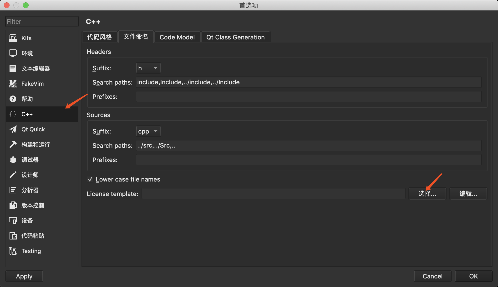
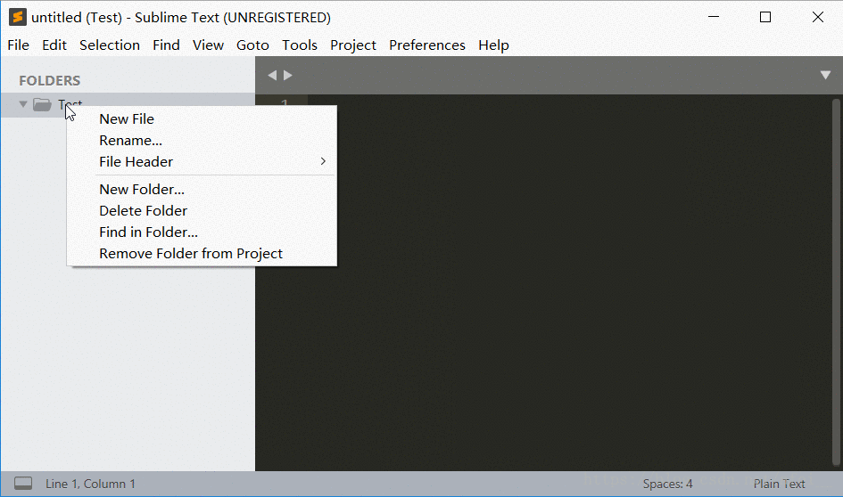

# 使用qt creator自动加入license文件头

打开qt_creator的选项页面，按以下步骤操作，选择本仓库提供的并且你自己修改了一些信息的droid_cpp_template.cpp文件即可。

之后每次使用qt_creator创建新cpp或.h .hpp文件时会自动加上该文件的内容。

## 使用Sublime Text自动加入license文件头

请参考：[这个链接](https://blog.csdn.net/afei__/article/details/82890493)

