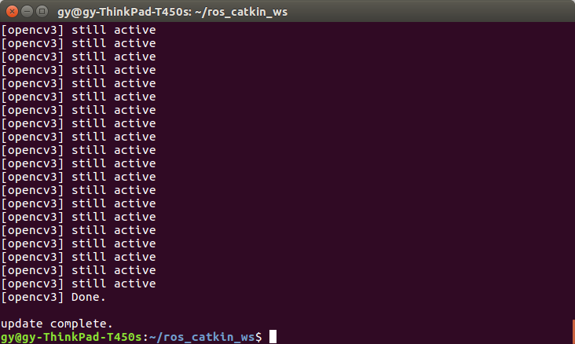
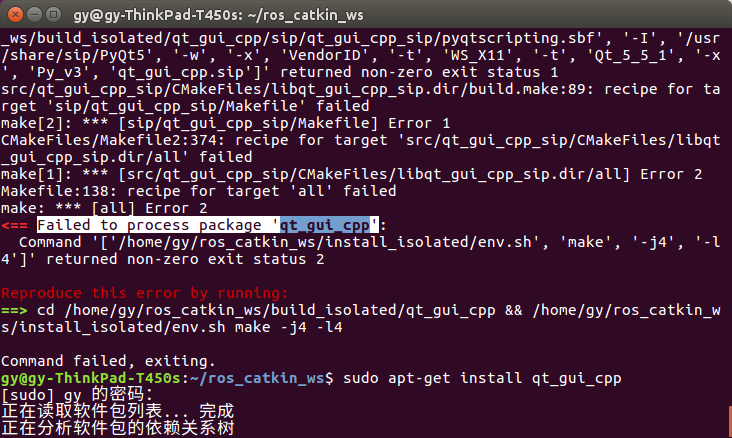
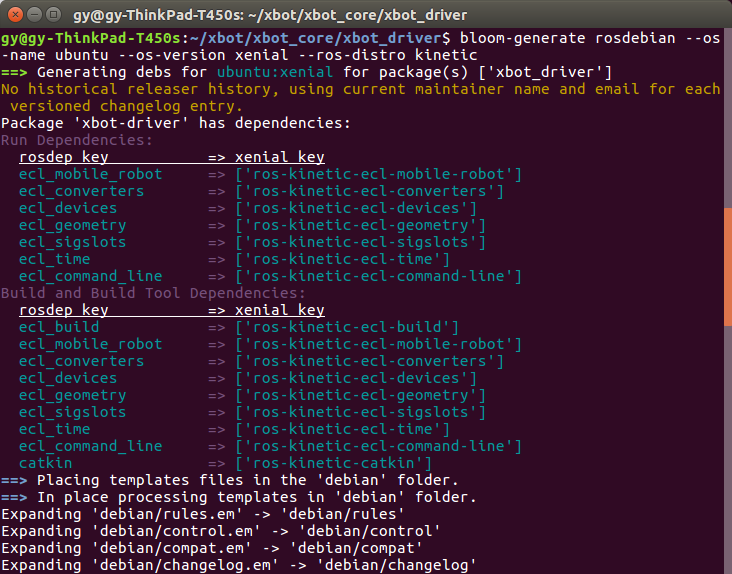
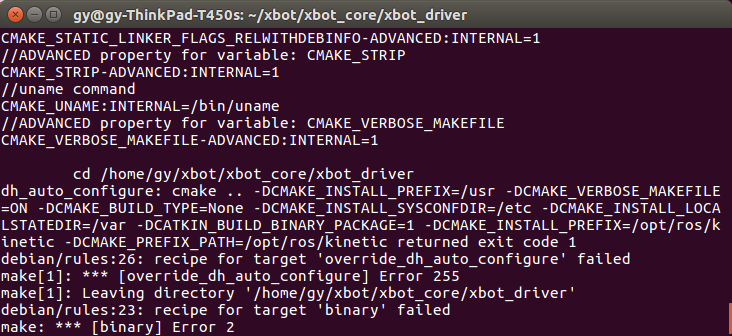

环境：ubuntu 16.04

# ROS安装部署(源码安装）

[ROS install from source](http://wiki.ros.org/kinetic/Installation/Source)

1. 安装引导依赖：

    sudo apt-get install python-rosdep python-rosinstall-generator python-wstool python-rosinstall build-essential

2. 安装rosdep：
   rosdep：用于安装系统依赖项的命令行工具。

    sudo rosdep init
    rosdep update

3. 创建catkin工作环境：

    mkdir ~/ros_catkin_ws
    cd ~/ros_catkin_ws

4. 安装ROS:

    rosinstall_generator desktop --rosdistro kinetic --deps --wet-only --tar > kinetic-desktop-wet.rosinstall
    wstool init -j8 src kinetic-desktop-wet.rosinstall

   

5. 解决依赖关系：

    rosdep install --from-paths src --ignore-src --rosdistro kinetic -y

6. 隔离构建catkin工作区：

    ./src/catkin/bin/catkin_make_isolated --install -DCMAKE_BUILD_TYPE=Release

   形成.bash，source它以获取其中信息：

    source ~/ros_catkin_ws/install_isolated/setup.bash

   编译命令运行报错的处理：

   

   多数情况下是依赖包未找到，如 poco not found，查找此包并安装：

    apt-cahe search poco | grep (-i) poco

   选择形如libpoco-dev或libpoco-all-dev进行安装

    sudo apt-get install (-y) libpoco-dev

# 将xbot工程打deb包：

    bloom可自动化debian过程

1. 安装bloom：
   
   [bloom](http://bloom.readthedocs.io/en/0.5.10/)

    sudo apt-get install python-bloom

2. 运行bloom-generate：

   [bllom-generate](http://answers.ros.org/question/173804/generate-deb-from-ros-package/)

   进入需要打包的工程文件夹，含package.xml
 
    cd path/to/your/catkin/package
    bloom-generate rosdebian --os-name ubuntu --os-version xenial --ros-distro kinetic
   
   --os-version: 运行lsb_release -a，codename下得到，ubuntu16.04对应xenial。

   日志及处理：

   

   右边是依赖项，依次下载，否则下一步报错。

    fakeroot debian/rules binary

   

   如出现上述报错，请确定bloom-generate步骤中的依赖项装载完全并重新执行

3. 打包成功：
   
   日志提示打包成功，当前文件夹下出现.deb文件，安装命令dpkg -i <package.deb>，勿在本机安装，或造成系统崩溃等不良后果。   
