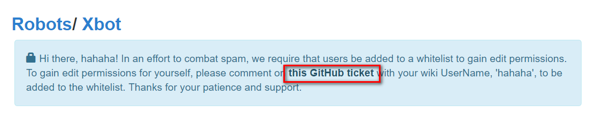
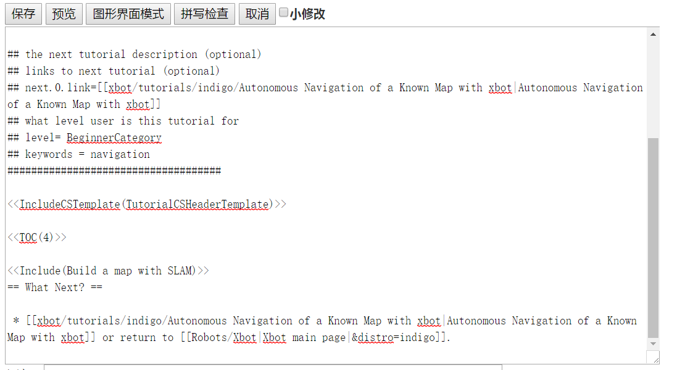
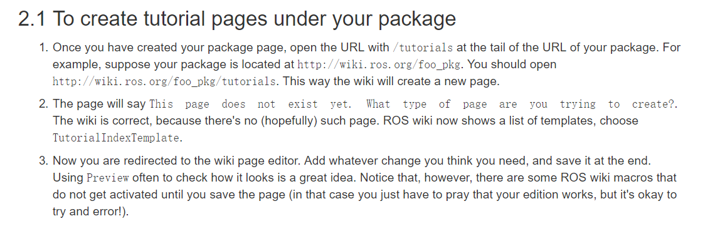
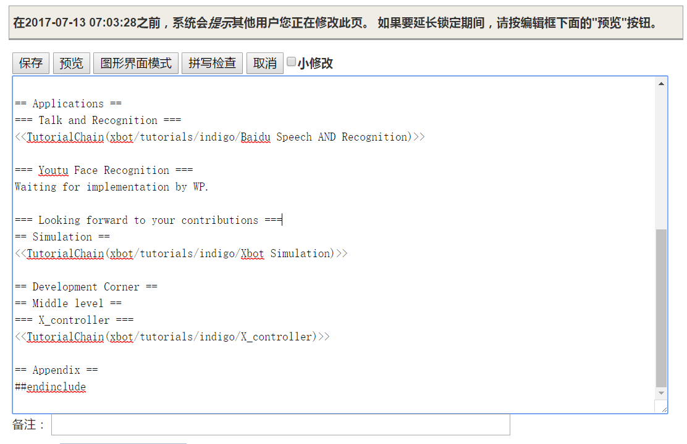
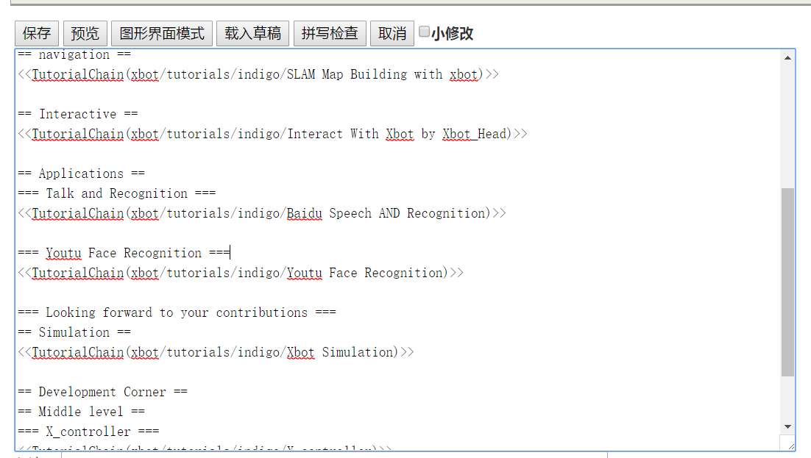
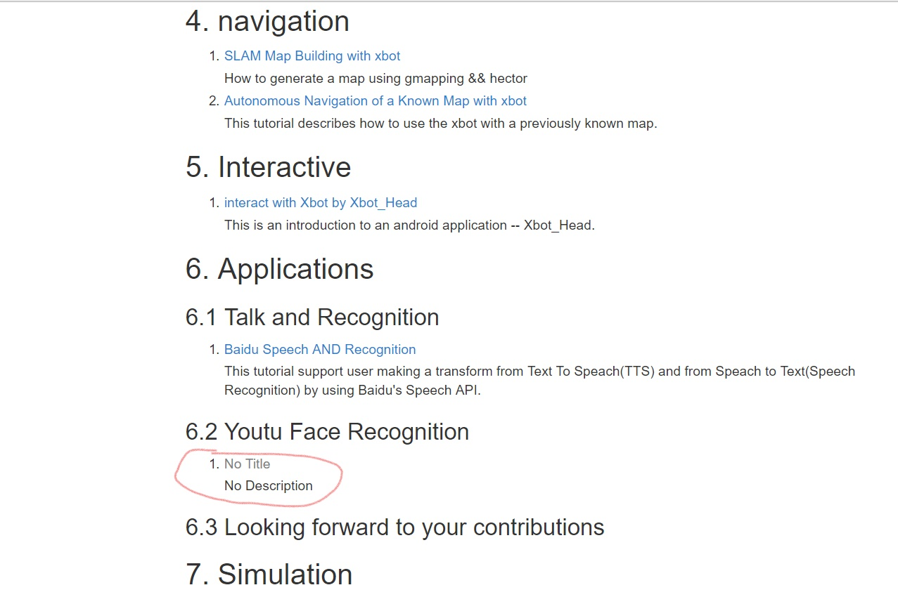
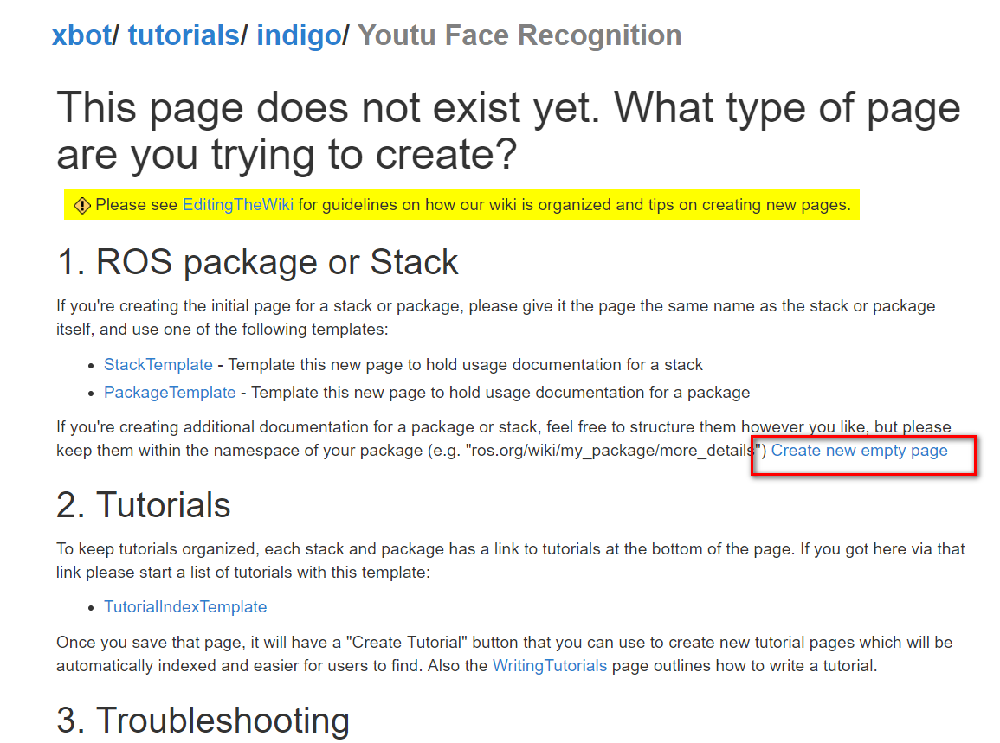
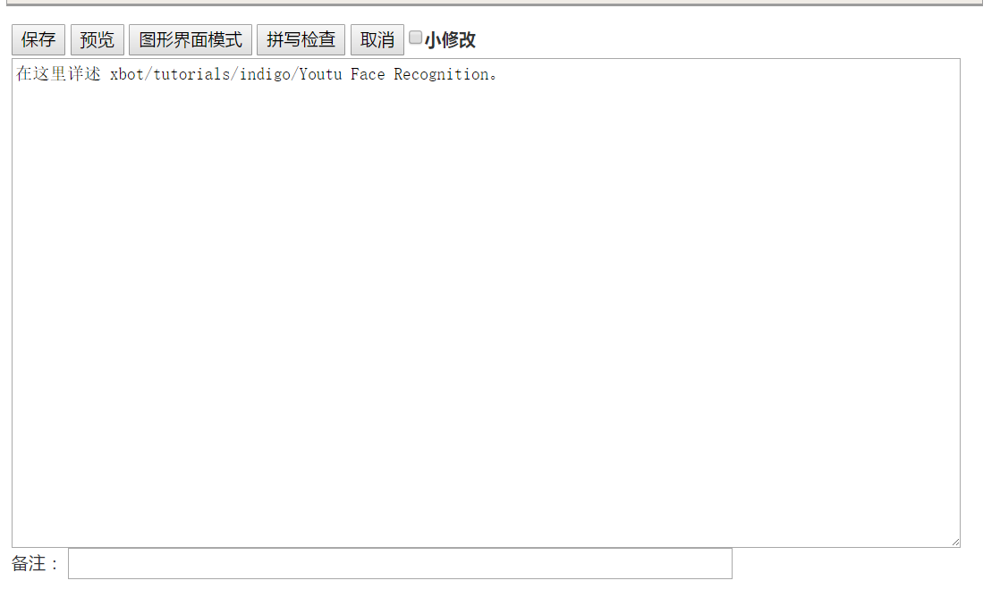
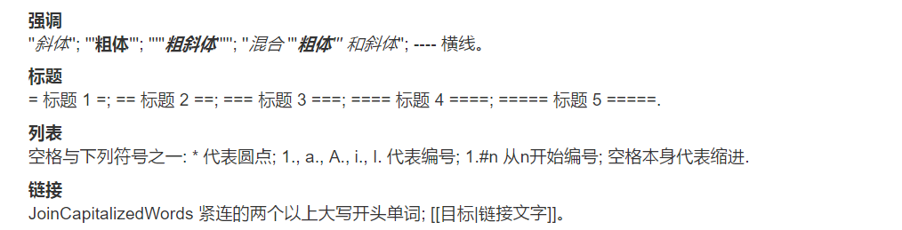
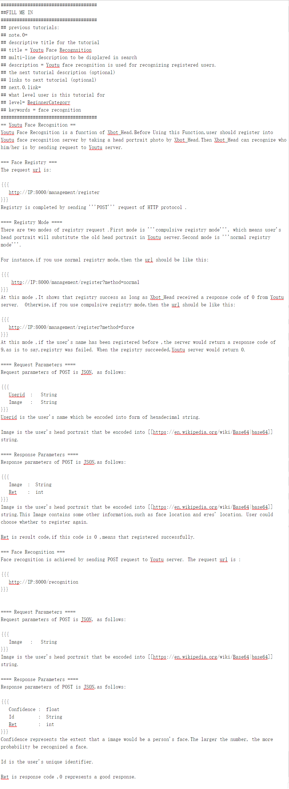

#  RosWiki编后感——How RosWiki Works

​								                                                   by  -- [PaperFish](https://www.github.com/lisongting)

昨天编写了RosWiki中[indigo栏目](http://wiki.ros.org/xbot/tutorials/indigo)下的两个条目，写下这篇报告，记录我在编写RosWiki过程中遇到的困惑，以及我对RosWiki条目结构的理解。

正式开始： ~~roswiki从入门到放弃~~ 。不是，是How RosWiki Works.

## 注册 

开始编辑前当然是先注册，注册页面如下：


ros.org 估计是为了简单验证下内容编写者是不是个合格的文化人，最后这里还问我S是什么，这里的S当然是指`System` 了。

填好信息后，登陆成功后，此时还不能编写。会出现以下的提示信息:


点击**this GitHub ticket** 之后，进入了一个github的issue页面：https://github.com/ros-infrastructure/roswiki/issues/139.

然后在这个Issue底部回复注册时填写的用户名，当项目维护者看到我的用户名之后，就会把我添加到拥有编辑权限的人员列表里。这样做的目的可能是将内容编辑者与github绑定在一起，就好比看个直播还要绑定身份证和手机号一样，有个约束，以防止用户乱搞。

在等待项目维护者回复的过程中，我乖乖地把**编写教程的教程** 看了一遍:http://wiki.ros.org/WritingTutorials。

## 编写前的一些疑惑

[http://wiki.ros.org/Robots/Xbot](http://wiki.ros.org/Robots/Xbot) 是主页面，其中的indigo栏目中的两个条目是我要编写的。拥有写权限后，并登陆成功，就会在页面右边看到有`编辑(文本方式)` 和`编辑(图形界面)` 的选项。

点击**编辑(文本方式)** 之后，进入了编辑页面，编辑页面中可编辑的内容如下：

```
= Xbot =

'''Maintainers: [[DinnerHowe| Howe]](xu zhihao), [[rocwang| Roc]](wangpeng), [[chaichangkun| Changkun]](chaichangkun), [[??| ??]](wuwei)'''


<<Version()>>

{{attachment:xbot.png|Xbot 1|width=50%,align="right"}}

Xbot is a double wheeled mobile robot developed by Xlab in [[http://www.is.cas.cn/| ISCAS]]  (Institute of Software Chinese Academy of Science) and [[http://bestimage.qq.com/| YouTu Lab]] in Tencent. The hardware and software of Xbot is designed, assembled and developed by Xlab, with great help from YouTu on face recognition and some other techniques.

Xbot is suitable for most of common sensors and hardware such as Microsoft's Kinect and Asus' Xtion Pro and RPlidar. Users can easily integrate their own customized hardware and applications to the development platform by using ROS and the related series tutorials. 

Please visit [[https://github.com/XbotGroup]] for more details.

{{{#!wiki version hydro
<<Include(Robots/Xbot/hydro)>>
}}}

{{{#!wiki version indigo
<<Include(Robots/Xbot/indigo)>>
}}}

{{{#!wiki version jade
<<Include(Robots/Xbot/jade)>>
}}}

{{{#!wiki version kinetic_and_newer
<<Include(Robots/Xbot/kinetic)>>
}}}
```

一开始看到这个，WTF ?这个页面是什么鬼？  只有这么点可编辑的内容，这该从哪里下手编辑我的indigo栏目？

直觉告诉我，这是一种页面引用。

我记得[编写教程的教程](http://wiki.ros.org/WritingTutorials) 中并没有告诉我这个`<<Include(Robots/Xbot/kinetic)>>`  是什么意思啊以及如何编写这个`include` 中包含的页面啊？

又乖乖地把[编写教程的教程](http://wiki.ros.org/WritingTutorials) 看了一遍，发现底部有一个新手视频，视频也进去看看吧，进去之后，（我把眼镜擦了两遍才看的）忍不住吐槽：不是我眼镜的锅，这确实是AV画质，我连字都看不清。

既然这条路走不通，那就看看原有的教程是怎么写的吧，随便进入indigo条目中的一个页面：[http://wiki.ros.org/xbot/tutorials/indigo/SLAM%20Map%20Building%20with%20xbot]([http://wiki.ros.org/xbot/tutorials/indigo/SLAM%20Map%20Building%20with%20xbot) . 看看其他大神是怎么写的。

点击编辑之后，终于看到原码了：



滚动条都拖到底了，只有这么点信息。感觉又是一种界面引用，但这个`<<TOC(4)>>` 是什么啊？

我又查了一些网页，仍然没搞懂这个`TOC(4)` 是什么。

当时比较消极，一度想放弃。

此时的心情就好比这样：


## 找到突破 

经过一番尝试后，终于还是从这个页面中找到了突破：http://wiki.ros.org/ROS/Tutorials/NavigatingTheWiki.



哦，貌似有点懂了。原来RosWiki是通过URL拼接的方式组织的。

比如在http://wiki.ros.org/ROS/Tutorials 中，有一篇文章名是**Navigating The Wik** ,该文章的URL就是http://wiki.ros.org/ROS/Tutorials/NavigatingTheWiki.

然后第2条告诉我，如果我们想要找到某一篇文章，则在对应目录后面输入教程的标题。**如果该教程不存在，roswiki就会提示我们进行创建**。


按照这种方法，想要进入xbot的indigo页面，就可以按照url拼接：`http://wiki.ros.org/` 拼上`xbot/tutorials/` 拼上` indigo` .

得到[http://wiki.ros.org/xbot/tutorials/indigo](http://wiki.ros.org/xbot/tutorials/indigo) .进入后，应该就可以编辑了吧。

点击`编辑(文本形式)` ,进入文本编辑模式：



我要编写的是**Youtu Face Recognition** 条目，先看看其他条目是怎么编写的，其他页面是使用`TutorialChain` 形式，从字面意思看，这是教程链。如果我点开SLAM Map Building with xbot，则URL地址会是`http://wiki.ros.org/xbot/tutorials/indigo/SLAM%20Map%20Building%20with%20xbot` .原来这就是教程链接，后缀是文章标题的另一种形式，空格都用`%20` 来填充。

照葫芦画瓢，那么也照着上面的形式，写一个`TutorialChain` 引用吧。



写好后，保存，回到网页页面。可看到下面的结果：



这里已经出现了一个`No Title` ，表示这里有引用，但是还没有详细页面。

点击`No Title` ，进入后，



貌似有解决办法了。它告诉我页面不存在，那就创建一个，点击下面的`Create new empty page` 。进入：



哈哈，可以编辑了！

用[编写教程的教程](http://wiki.ros.org/WritingTutorials) 中提供的模板：

```
####################################
##FILL ME IN
####################################
## for a custom note with links:
## !note =
## for the canned note of "This tutorial assumes that you have completed the 
## previous tutorials:" just add the links 
## !note.0= 
## descriptive title for the tutorial
## !title =
## multi-line description to be displayed in search 
## !description = 
## the next tutorial description (optional)
## !next =
## links to next tutorial (optional)
## !next.0.link=
## !next.1.link=
## what level user is this tutorial for 
## !level= (BeginnerCategory, IntermediateCategory, AdvancedCategory)
## !keywords =
####################################

!<<IncludeCSTemplate(TutorialCSHeaderTemplate)>>
```

结合roswiki的编辑语法（与MarkDown截然不同的语法）：



最后我编写的页面如下：



网页中显示的效果是：


**大功告成，终于编写好了！** 

