# Ros Server与Android端的交互[测试报告] 

​                                                                           by--[PaperFish](https://github.com/lisongting)

> 环境说明：虚拟机Ubuntu14.04，Ros版本为Indigo。

基本思路：

首先在Ubuntu上启动`roscore` 和`rosbridge_websocket.launch` ，然后在Ubuntu上运行两个python程序，一个python程序用来发送topic为`/museum_position` 的Message，然后在Android端对这个topic进行订阅并接收数据，另一个python程序用来接收来自Android端发送的topic为`/tts_status` 的Message。


## 开始

### 1.在Ubuntu中打开terminal，运行`roscore`（确保Ubuntu中已经安装好Ros）。

注：我是在Ros Package目录下，运行rosbridge_websocket.launch （其实不在这个目录下运行rosbridge_websocket.launch也可以，只要能运行起来就行） 。由于我创建的Ros Package是catkin_ws，我是根据[Ros官方教程](http://wiki.ros.org/ROS/Tutorials) 创建的。catkin_ws的位置如下图所示：

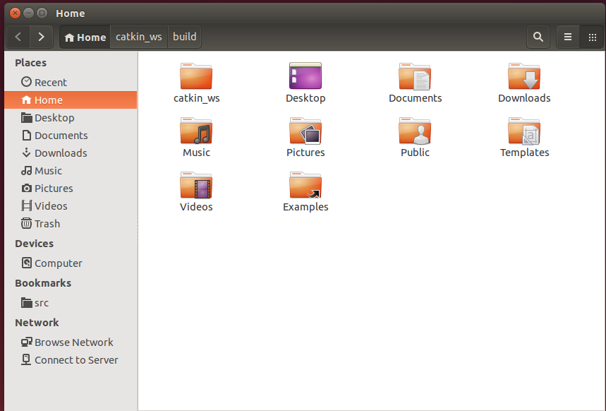

### 2.新开一个命令行窗口，依次运行：

```
source ./devel/setup.bash
roslauch rosbridge_server rosbridge_websocket.launch
```

运行起来后如下图所示：

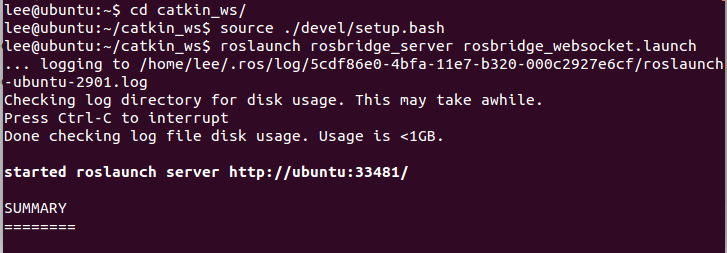

###  3.在catkin_ws中写topic的发布程序和接收程序

我首先定义的两个Message为：

TtsStaus.msg

```
int32 id
bool isplaying
```

RobotStatus.msg

```
int32 id
bool ismoving
```

因为要在python中使用这两个自定义的Message，为了让编译环境能够识别，还要配置同目录下的package.xml和CMakeLists.txt。

我的package.xml如下（删除了部分无用代码）：

```xml
<package>
<name>beginner_tutorials</name>
<version>0.0.0</version>
<description>The beginner_tutorials package</description>

<maintainer email="lee@todo.todo">lee</maintainer>
<build_depend>message_generation</build_depend>
<run_depend>message_runtime</run_depend>

<!--    <test_depend>gtest</test_depend>  -->
<buildtool_depend>catkin</buildtool_depend>
<build_depend>roscpp</build_depend>
<build_depend>rospy</build_depend>
<build_depend>std_msgs</build_depend>
<run_depend>roscpp</run_depend>
<run_depend>rospy</run_depend>
<run_depend>std_msgs</run_depend>
<!--  The export tag contains other, unspecified, tags  -->
<export>
<!--
 Other tools can request additional information be placed here 
-->
</export>
</package>
```

CMakeLists.txt为（删除了部分无用代码）：

```cmake
cmake_minimum_required(VERSION 2.8.3)
project(beginner_tutorials)
## Add support for C++11, supported in ROS Kinetic and newer
# add_definitions(-std=c++11)
## Find catkin macros and libraries
## if COMPONENTS list like find_package(catkin REQUIRED COMPONENTS xyz)
## is used, also find other catkin packages
find_package(catkin REQUIRED COMPONENTS
  roscpp
  rospy
  std_msgs
  message_generation
)
## System dependencies are found with CMake's conventions
# find_package(Boost REQUIRED COMPONENTS system)
# catkin_python_setup()
## Generate messages in the 'msg' folder
 add_message_files(
   FILES
   Num.msg
   RobotStatus.msg
   TtsStatus.msg
 )
## Generate services in the 'srv' folder
 add_service_files(
   FILES
   AddTwoInts.srv
 )
# add_action_files(
#   FILES
#   Action1.action
#   Action2.action
# )
 generate_messages(
   DEPENDENCIES
   std_msgs
   beginner_tutorials
 )
# generate_dynamic_reconfigure_options(
#   cfg/DynReconf1.cfg
#   cfg/DynReconf2.cfg
# )
catkin_package(
  INCLUDE_DIRS include
  LIBRARIES beginner_tutorials
   CATKIN_DEPENDS roscpp rospy std_msgs message_runtime 
  DEPENDS system_lib
)
# include_directories(include)
include_directories(
  ${catkin_INCLUDE_DIRS}
)
## Declare a C++ library
# add_library(${PROJECT_NAME}

# add_dependencies(${PROJECT_NAME} ${${PROJECT_NAME}_EXPORTED_TARGETS} ${catkin_EXPORTED_TARGETS})

# add_executable(${PROJECT_NAME}_node src/beginner_tutorials_node.cpp)

# set_target_properties(${PROJECT_NAME}_node PROPERTIES OUTPUT_NAME node PREFIX "")

## Add cmake target dependencies of the executable
## same as for the library above
# add_dependencies(${PROJECT_NAME}_node ${${PROJECT_NAME}_EXPORTED_TARGETS} ${catkin_EXPORTED_TARGETS})
## Specify libraries to link a library or executable target against
# target_link_libraries(${PROJECT_NAME}_node
#   ${catkin_LIBRARIES}
# )
## Mark executable scripts (Python etc.) for installation
## in contrast to setup.py, you can choose the destination
# install(PROGRAMS
#   scripts/my_python_script
#   DESTINATION ${CATKIN_PACKAGE_BIN_DESTINATION}
# )
## Mark executables and/or libraries for installation
# install(TARGETS ${PROJECT_NAME} ${PROJECT_NAME}_node
#   ARCHIVE DESTINATION ${CATKIN_PACKAGE_LIB_DESTINATION}
#   LIBRARY DESTINATION ${CATKIN_PACKAGE_LIB_DESTINATION}
#   RUNTIME DESTINATION ${CATKIN_PACKAGE_BIN_DESTINATION}
# )
## Mark cpp header files for installation
# install(DIRECTORY include/${PROJECT_NAME}/
#   DESTINATION ${CATKIN_PACKAGE_INCLUDE_DESTINATION}
#   FILES_MATCHING PATTERN "*.h"
#   PATTERN ".svn" EXCLUDE
# )
## Mark other files for installation (e.g. launch and bag files, etc.)
# install(FILES
#   # myfile1
#   # myfile2
#   DESTINATION ${CATKIN_PACKAGE_SHARE_DESTINATION}
# )
## Add gtest based cpp test target and link libraries
# catkin_add_gtest(${PROJECT_NAME}-test test/test_beginner_tutorials.cpp)
# if(TARGET ${PROJECT_NAME}-test)
#   target_link_libraries(${PROJECT_NAME}-test ${PROJECT_NAME})
# endif()
## Add folders to be run by python nosetests
# catkin_add_nosetests(test)
```

Ros topic发布程序为rosPublisher.py：

```py
#!/usr/bin/env python
import rospy
from  beginner_tutorials.msg import RobotStatus

def sender():
	pub = rospy.Publisher('/museum_position',RobotStatus,queue_size=10)
	rospy.init_node('rosPublisher',anonymous=True)
	rate = rospy.Rate(5)
	a = 1
	while not rospy.is_shutdown():
		status = RobotStatus()
		s = raw_input("Input id:")
		try:
			status.id = int(s)
		except:
			break
		 
		status.ismoving = False

		print('sending: ',status.id ,status.ismoving)		

		pub.publish(status)
		rate.sleep()
			
if __name__ == '__main__':
	try:
	    sender()
	except rospy.ROSInterruptException:
            pass
```

Ros topic的接收程序为rosReceiver.py:

```pyt
#!/usr/bin/env python
import rospy
from  beginner_tutorials.msg import TtsStatus

def callback(data):
	print('Received TtsStatus:',data.id,data.isplaying)

def getter():
	print("RosReceiver is running...")
	rospy.init_node('rosreceiver', anonymous=True)
   	rospy.Subscriber('tts_status', TtsStatus, callback)
	rospy.spin()

if __name__ == '__main__':
	getter()

```

### 4.运行rosPublisher.py

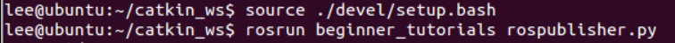

现在Ubuntu上的topic发布程序已经启动起来了。

### 5.运行Android端App

Android端的Ros交互程序，我是使用了这个开源[APP](https://github.com/hibernate2011/RosClient) ，也可以点击[这个链接](https://fir.im/1laj) 直接下载安装到安卓设备上。

打开该APP后：


我的Ubuntu的ip是192.168.1.179，端口是9090。点击Connect。

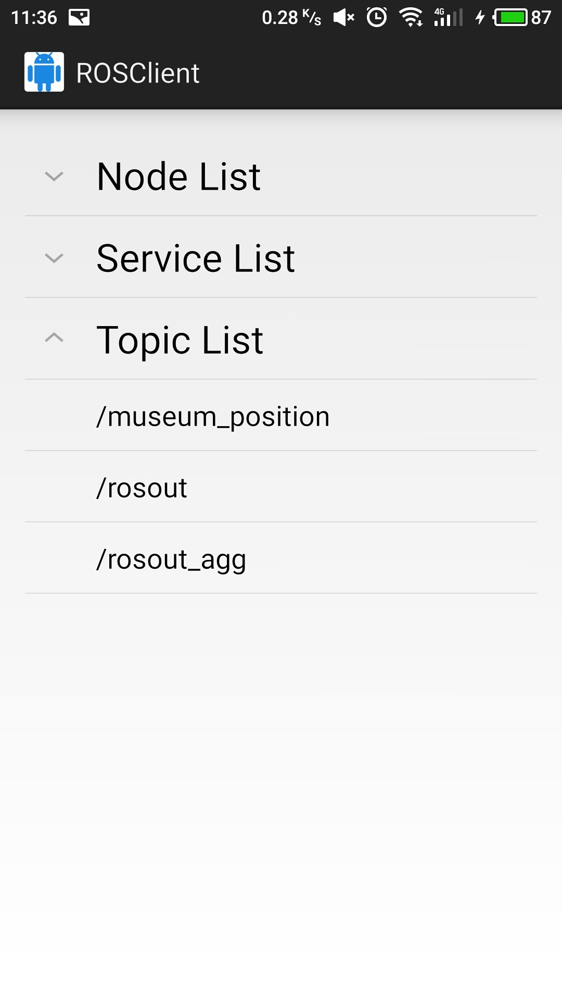

就可以看到有一个topic的名称为"/musemu_position"，这就是Ubuntu中rosPublisher发布的topic。

点击这个"/musemu_position"，进入：

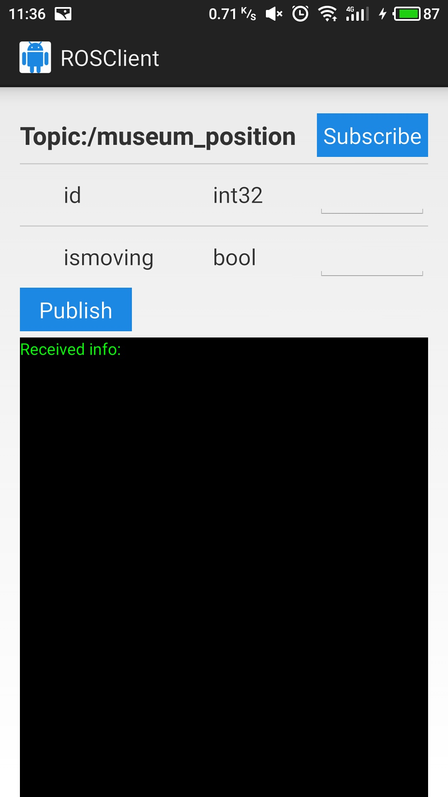

点击"subscribe"按钮，这就表示已经订阅了该topic。

然后在Ubuntu上尝试发布Message:

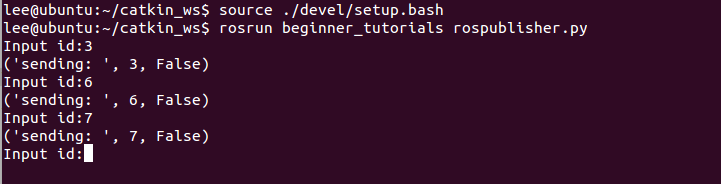

我这里输入了id后，发布的topic中"ismoving"字段默认设为False。（这里并不影响，因为只是出于测试的目的）

在Android端就可以看到：

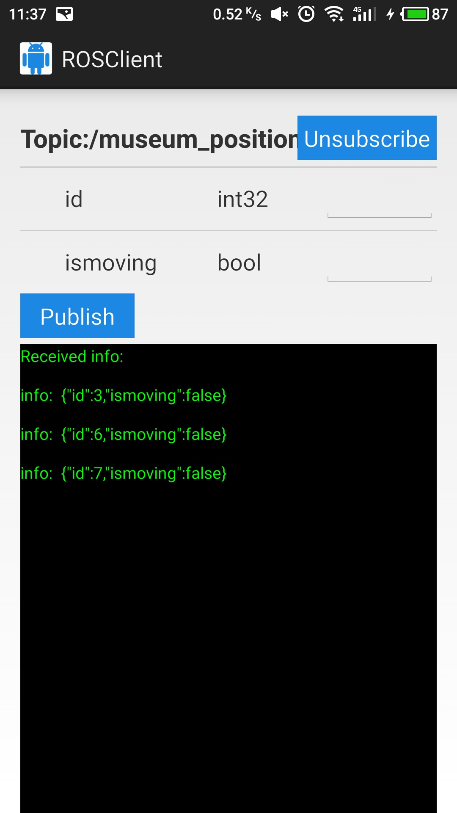

这表明已经接受到rosPublisher发过来的topic信息了。

### 6.运行rosReciever.py 

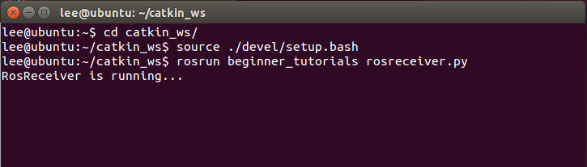

### 7.在Android端发布topic 

打开APP，可以看到多了一个topic，名称为"/tts_status"：

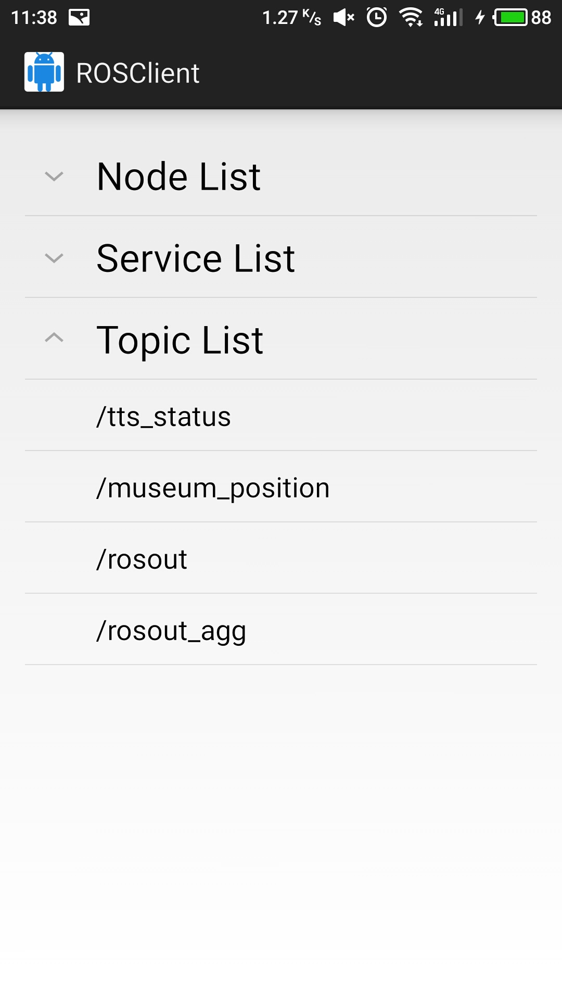

点击"/tts_status"之后，尝试发布Message。


输入数据后，点击Publish，在rosReceiver中就可以看到：

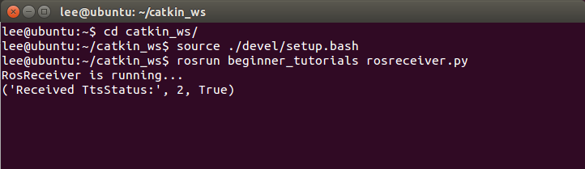

这表明rosReceiver已经接收到Android端发来的Message信息。

还可以运行`rqt_graph`查看一下node和topic的信息：

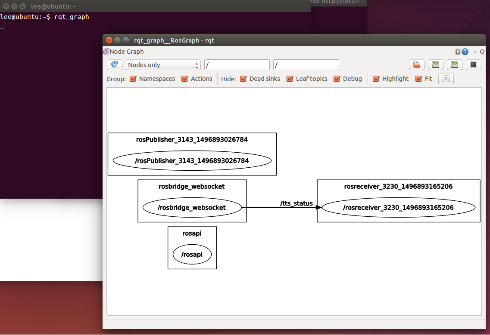

可以看到节点"/rosbridge_websocket"通过topic "tts_status"来向"/rosreceiver"节点发送数据。

至此，测试效果已经达到。

## 入坑记录 

之前我在第5步骤中，Android端连接"/museum_position"时会造成Ubuntu中**运行 "rosbridge_websocket.launch"的那个窗口** 报错。报错如下：

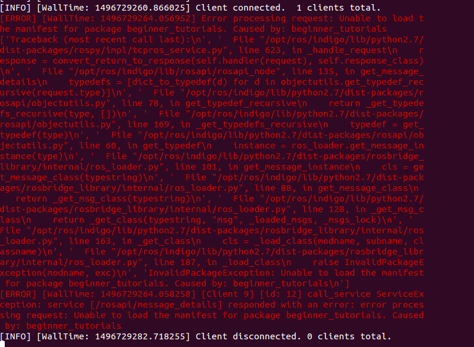

后来找到报错原因：

是因为在运行`roslaunch rosbridge_server rosbridge_websocket.launch` 之前没有有运行`source ./devel/setup.bash` 。


source命令用法：

source FileName

作用:在**当前bash环境下**读取并执行**FileName中**的命令。该filename文件可以无”**执行权限**”。

注：该命令通常用命令“.”来替代。

如：source .bash_profile

. .bash_profile两者等效。

source(或点)命令通常用于重新执行刚修改的初始化文档。

source命令(从 C Shell 而来)是bash shell的内置命令。

点命令，就是个点符号，(从Bourne Shell而来)。

