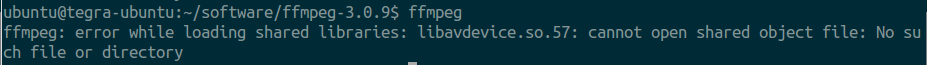

# Xbot摄像头直播环境搭建

之前也写了一个流媒体直播环境搭建的报告，[在这里](https://github.com/lazyparser/weloveinterns/blob/master/reports/%E6%90%AD%E5%BB%BANginx%E6%B5%81%E5%AA%92%E4%BD%93%E6%9C%8D%E5%8A%A1%E5%99%A8%E5%B9%B6%E4%BD%BF%E7%94%A8ffmpeg%E8%BF%9B%E8%A1%8C%E6%8E%A8%E6%B5%81.md)。用于Xbot环境搭建教程的话还不够详细，所以有了这篇教程，这篇教程是用于在Xbot中搭建摄像头直播环境，算是对上一篇的补充版。

使用的摄像头：ASUS Xtion Pro Live或者Kinect。

## 1.安装一些依赖包

首先执行

```shell
sudo apt-get update

sudo apt-get install build-essential git-core checkinstall texi2html libfaac-dev libtool

sudo apt-get install libopencore-amrnb-dev libopencore-amrwb-dev libsdl1.2-dev libtheora-dev 

sudo apt-get install libvorbis-dev libx11-dev libxfixes-dev zlib1g-dev libgtk2.0-dev libavcodec-dev libavformat-dev  libtiff4-dev cmake libswscale-dev libjasper-dev
```

## 2.安装OpenCV

首先创建一个叫做software的文件夹，然后我会将下面要安装的东西都放在这里。

```shell
mkdir software
cd software
wget https://github.com/opencv/opencv/archive/3.2.0.zip
sudo unzip 3.2.0.zip 
cd opencv-3.2.0
cmake .
make			#这个过程比较久
sudo make install
```

建议在执行上面make的过程中，新开一个终端进行下面的安装步骤。因为这个make 过程比较耗时。

## 3.安装OpenNI2

在[OpenNI官网](https://structure.io/openni) 下载压缩包，注意要区分平台。

如果是ARM架构的则运行：

```shell
cd software
wget https://s3.amazonaws.com/com.occipital.openni/OpenNI-Linux-Arm-2.2.0.33.tar.bz2
sudo tar -axvf OpenNI-Linux-Arm-2.2.0.33.tar.bz2 
cd OpenNI-Linux-Arm-2.2
sudo ./install
```


x86架构：`wget https://s3.amazonaws.com/com.occipital.openni/OpenNI-Linux-x86-2.2.0.33.tar.bz2`

x64架构：`wget https://s3.amazonaws.com/com.occipital.openni/OpenNI-Linux-x64-2.2.0.33.tar.bz2`


## 4.安装FFMPEG

首先安装h264 视频编解码库：

```shell
sudo apt-get install libx264-dev
cd software
git clone git://git.videolan.org/x264
cd x264
./configure --enable-shared   
make	
sudo make install
```


安装ffmpeg ，依次输入以下命令：

```shell
cd software
wget http://ffmpeg.org/releases/ffmpeg-3.0.9.tar.bz2
sudo tar jxvf ffmpeg-3.0.9.tar.bz2
cd ffmpeg-3.0.9/
sudo ./configure --enable-shared --enable-pthreads --enable-gpl  --enable-avresample --enable-libx264 --enable-libtheora  --disable-yasm

make	      #这个过程比较久，大约半个小时
sudo make install
```

安装完ffmpeg之后，在命令行中输入`ffmpeg` 就可以看到类似下面的输出信息：

```shell
lee@ubuntu:~$ ffmpeg
ffmpeg version 3.0.9 Copyright (c) 2000-2017 the FFmpeg developers
  built with gcc 4.8 (Ubuntu 4.8.4-2ubuntu1~14.04.3)
  configuration: --enable-pthreads --enable-gpl --enable-avresample --enable-libx264 --enable-libtheora --disable-yasm
  libavutil      55. 17.103 / 55. 17.103
  libavcodec     57. 24.102 / 57. 24.102
  libavformat    57. 25.100 / 57. 25.100
  libavdevice    57.  0.101 / 57.  0.101
  libavfilter     6. 31.100 /  6. 31.100
  libavresample   3.  0.  0 /  3.  0.  0
  libswscale      4.  0.100 /  4.  0.100
  libswresample   2.  0.101 /  2.  0.101
  libpostproc    54.  0.100 / 54.  0.100
Hyper fast Audio and Video encoder
usage: ffmpeg [options] [[infile options] -i infile]... {[outfile options] outfile}...

Use -h to get full help or, even better, run 'man ffmpeg'

```

如果出现上面这样的信息，说明ffmpeg已经安装成功了。


如果出现下面这样的错误：



则执行：

```shell
sudo vi /etc/ld.so.conf
```

在该文件下方添加一行：`/usr/local/lib`  ，保存。

然后执行:

```shell
sudo ldconfig
```

则此时再执行`ffmpeg` 就不会报错了。

## 5.安装Nginx依赖

安装nginx依赖。首先在software目录下创建一个叫做nginx-dependence的文件夹

```shell
cd software
mkdir nginx-dependence
```

然后在nginx-dependence中安装依赖，按行依次运行以下命令。这些依赖一定不要使用`apt-get` 安装 ，因为后面在配置Nginx的时候，要提供这些依赖的源码路径。（我一开始是使用`apt-get` 安装 依赖的，结果在nginx 的`configure` 步骤出现问题，所以我就重新安装了）

```shell
cd nginx-dependence
sudo wget ftp://ftp.csx.cam.ac.uk/pub/software/programming/pcre/pcre-8.40.tar.gz
sudo tar -zxvf pcre-8.40.tar.gz
cd pcre-8.40/
sudo ./configure
sudo make
sudo make install
cd ..

sudo wget http://zlib.net/zlib-1.2.11.tar.gz
sudo tar -zxvf zlib-1.2.11.tar.gz
cd zlib-1.2.11/
sudo ./configure
sudo make
sudo make install
cd ..

sudo wget https://www.openssl.org/source/old/1.1.0/openssl-1.1.0.tar.gz
sudo tar -axvf openssl-1.1.0.tar.gz
cd openssl-1.1.0/
sudo ./config
sudo make
sudo make install
```

在nginx-dependence目录中，先下载nginx-rtmp-module

```shell
git clone https://github.com/arut/nginx-rtmp-module.git
```


## 6.安装Nginx

下载并安装Nginx，我安装的版本是1.12.0。

依次运行下面的指令。

```shell
cd software
sudo wget http://nginx.org/download/nginx-1.12.0.tar.gz
sudo tar -zxvf nginx-1.12.0.tar.gz
cd nginx-1.12.0/

sudo ./configure --prefix=/usr/local/nginx --with-pcre=../nginx-dependence/pcre-8.40 --with-zlib=../nginx-dependence/zlib-1.2.11 --with-openssl=../nginx-dependence/openssl-1.1.0  --with-http_ssl_module --add-module=../nginx-dependence/nginx-rtmp-module

sudo make
sudo make install
```

`--with-pcre=../nginx-dependence/pcre-8.40` 就是我的pcre依赖所放置的位置，这个位置可根据自己的安装位置进行灵活配置。`--add-module=../nginx-dependence/nginx-rtmp-module ` 这个module 的路径也要正确设置为之前下载nginx-rtmp-module的路径。


如果上面的步骤都没有出错，则可以检验一下nginx是否已经安装正确了：

在命令行中输入这个命令启动nginx服务器：

```shell
sudo /usr/local/nginx/sbin/nginx
```

如果没有报任何错误，则可以打开浏览器看看nginx是否启动成功。

打开浏览器，输入`localhost`  或本机的IP地址，按回车，如果看到这样的界面，说明nginx已经安装成功并且启动成功了。


如果有的时候启动时出现这样的提示：


这是重复启动导致的。运行`sudo /usr/local/nginx/sbin/nginx -s stop`  可以先停止运行之前启动的，然后再次运行

`sudo /usr/local/nginx/sbin/nginx` 就没有问题了。


## 7.配置Nginx流媒体服务器

nginx服务器有一个配置文件叫做**nginx.conf** ，这个文件默认是位于**/usr/local/nginx/conf**  目录下。

执行`sudo vi /usr/local/nginx/conf/nginx.conf`

将这个文件改成这样：

```
worker_processes  1;
error_log  logs/error.log debug;

events {
    worker_connections  1024;
}
rtmp {
    server {
        listen 1935;
        application rgb{
            live on;
            allow all;
        }
        application depth{
            live on;
            allow all;
        }
    }
}

http {
    include       mime.types;
    default_type  application/octet-stream;
    sendfile        on;
    keepalive_timeout  65;
    server {
        listen       80;
        server_name  localhost;
        location / {
            root   html;
            index  index.html index.htm;
        }
        # redirect server error pages to the static page /50x.html
        error_page   500 502 503 504  /50x.html;
        location = /50x.html {
            root   html;
        }
    }
}
```

其中rtmp就是rtmp服务器模块，端口是1935，application我理解为一个路径。可以通过访问`rtmp://localhost/videotest` 来访问videotest这个资源。`live on ` 表示这是实时的传输，这不同于点播，点播就好比我在某视频网站上想看一个视频，无论我什么时候去点击，它会从头开始播放。而实时传输（直播），就是好比看电视，我在19:20去打开电视（打开直播流），视频不会从头开始播放，而是从当前(19:20)的视频数据开始播放。

除了配置rtmp服务器，还可以配置HTTP和HTTPS服务器。关于nginx服务器和其配置方式，请阅读[nginx官网](http://nginx.org/en/docs/) 。

## 8.运行摄像头推流程序

启动了nginx服务器后，就可以运行摄像头推流程序了。

这个摄像头推流的ROS程序位于(运行时要启动ros master节点):

 https://github.com/yowlings/xbot2/blob/master/xbot2_tools/src/camera_pusher.cpp

其原始C++代码位于(运行时无需启动ros master节点)：

https://github.com/lisongting/camera_pusher/blob/master/camera_pusher_program/camera_pusher.cpp

首先编译xbot2_tools包。
```shell
git clone https://github.com/yowlings/xbot2
catkin_make --pkg xbot2_tools
```

编译完成之后运行：
```shell
rosrun xbot2_tools camera_pusher
```

如果看到类似这样的输出，说明已经成功启动了推流程序：
```
lee@ubuntu:~$ rosrun xbot2_tools camera_pusher
[OK]      --  network init
[OK]      --  find avcodec
[OK]      --  set preset policy to ultrafast
[OK]      --  set tune policy to zerolatency
[OK]      --  set profile policy to baseline
[libx264 @ 0x2c892a0] using cpu capabilities: MMX2 SSE2Fast SSSE3 SSE4.2 AVX AVX2 FMA3 LZCNT BMI2
[libx264 @ 0x2c892a0] profile Constrained Baseline, level 3.0
[libx264 @ 0x2c89d60] using cpu capabilities: MMX2 SSE2Fast SSSE3 SSE4.2 AVX AVX2 FMA3 LZCNT BMI2
[libx264 @ 0x2c89d60] profile Constrained Baseline, level 3.0
[OK]      --  open avcodec
---------------Stream Info----------------------
Output #0, flv, to 'rtmp://localhost/rgb':
    Stream #0:0: Video: h264 (libx264), yuv420p, 640x480, q=2-30, 400 kb/s, 10k tbn
Output #0, flv, to 'rtmp://localhost/depth':
    Stream #0:0: Video: h264 (libx264), yuv420p, 640x480, q=2-30, 200 kb/s, 10k tbn
------------------------------------------------
[OK]      --  open RGB output  URL
[OK]      --  open Depth output  URL
[OK]      --  write RGB output header
[OK]      --  write Depth output header
[OK]      --  initialize openni  
Warning: USB events thread - failed to set priority. This might cause loss of data...
[OK]      --  open camera device
[OK]      --  start depth stream
[OK]      --  start color stream
[OK]      --  encode RGB video frame number:  0
[OK]      --  write RGB frame to output URL
[OK]      --  read depth frame
[OK]      --  encode Depth video frame number:  0
[OK]      --  write Depth frame to output URL
[OK]      --  encode RGB video frame number:  1
[OK]      --  write RGB frame to output URL
[OK]      --  read depth frame
[OK]      --  encode Depth video frame number:  1
[OK]      --  write Depth frame to output URL
[OK]      --  encode RGB video frame number:  2
[OK]      --  write RGB frame to output URL
[OK]      --  read depth frame
[OK]      --  encode Depth video frame number:  2
[OK]      --  write Depth frame to output URL
[OK]      --  encode RGB video frame number:  3
[OK]      --  write RGB frame to output URL
[OK]      --  read depth frame
[OK]      --  encode Depth video frame number:  3
[OK]      --  write Depth frame to output URL
[OK]      --  encode RGB video frame number:  4
[OK]      --  write RGB frame to output URL
[OK]      --  read depth frame
[OK]      --  encode Depth video frame number:  4
[OK]      --  write Depth frame to output URL
[OK]      --  encode RGB video frame number:  5
[OK]      --  write RGB frame to output URL
[OK]      --  read depth frame
[OK]      --  encode Depth video frame number:  5
[OK]      --  write Depth frame to output URL
#............
#............
```
接下来可以使用任何支持RTMP的媒体播放器进行播放。

如果服务器的IP地址是192.168.0.1，则：

* RGB图像直播流地址：`rtmp://192.168.0.1/rgb`
* 深度图像直播流地址：`rtmp://192.168.0.1/depth`