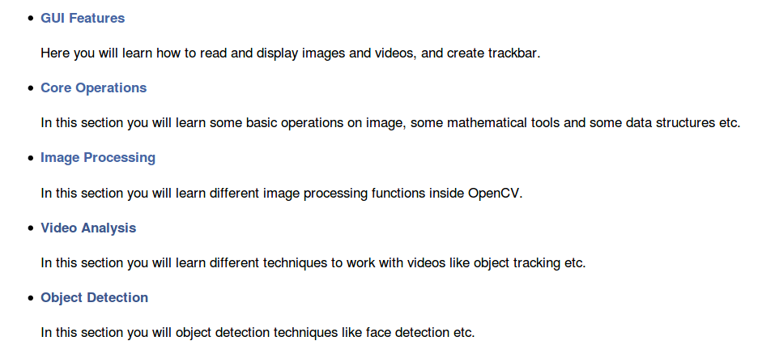
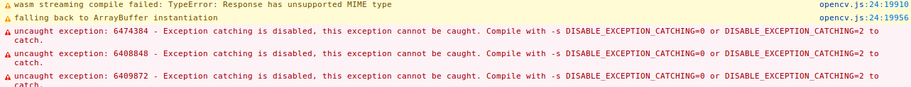
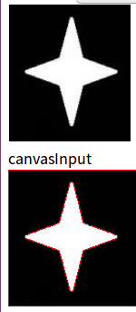
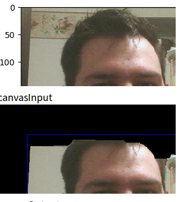
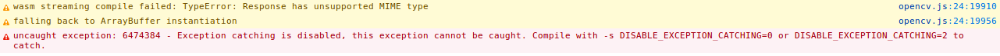

## Build OpenCV,js
### 安装Emscripten
<https://kripken.github.io/emscripten-site/docs/getting_started/downloads.html>

    git clone https://github.com/juj/emsdk.git
    cd emsdk
    git pull#本来教程使用emsdk update，但是报错提示使用git pull
    ./emsdk install latest #安装时下载报错，应该是ssl报错，可用wget --no-cookie --no-check-certificate url 解决，再将文件放入所要求的地发（终端报错处显示），不过我使用迅雷下载也解决了问题
    ./emsdk activate latest
    source ./emsdk_env.sh

此外，emsdk不提供任何工具，我们还要自己安装如python node.js CMake Java

    sudo apt-get install python2.7
    sudo apt-get install nodejs
    sudo apt-get install cmake
    sudo apt-get install default-jre
### 或手动安装Emscripten

    mkdir myfastcomp
    cd myfastcomp
    git clone https://github.com/kripken/emscripten-fastcomp
    cd emscripten-fastcomp
    git clone https://github.com/kripken/emscripten-fastcomp-clang tools/clang
    mkdir build
    cd build
    cmake .. -DCMAKE_BUILD_TYPE=Release -DLLVM_TARGETS_TO_BUILD="host;JSBackend" -DLLVM_INCLUDE_EXAMPLES=OFF -DLLVM_INCLUDE_TESTS=OFF -DCLANG_INCLUDE_TESTS=OFF
    LLVM_ROOT='/home/ubuntu/yourpath/emscripten-fastcomp/build/bin'
### 构建opencv

    git clone https://github.com/opencv/opencv.git
    cd opencv
    python ./platforms/js/build_js.py build_js

ccache官网http://ccache.samba.org下载ccache
1.解压缩 tar -zxvf ccache
2.进入ccache目录，./configure然后make再make install
3.安装成功

### 第二次尝试，不使用git安装，使用系统自带安装emscripten
因为有如下问题

尝试其他方法，系统apt安装

     sudo apt install emscripten
以上两个问题仍为解决，跳过
## demo
具体函数太多，各参数意思请参考<https://docs.opencv.org/3.3.1/d5/d10/tutorial_js_root.html>
注1 ：我的demo的命名方法，

对应于上图章节
注2：demo中**script src**设置为``要求html文件其必须存在于这个路径的某一节下，比如我就存在文件夹opencvjs下，而不能在其他地方，或者在其中另建一个文件夹作整理。否则会不能正常加载`opencv.js`
###
### image processing
1.得到灰度图像（demo：1_1.html）

     cv.cvtColor (src, dst, code, dstCn = 0)
2.对图像进行二值化（demo：3_1.html）
    
     cv.inRange (src, lowerb, upperb, dst)
3.对图像重新改变大小（demo：3_2_1.html）由于没有设置画布大小进行适应性设置，所以图像大小改变的不彻底，实属正常。

    let dsize = new cv.Size(300, 300);
    cv.resize(src, dst, dsize, 0, 0, cv.INTER_AREA);

如图，只将图像行变为300,列受限于canvas，并没有改变
4.将图像移动，M代表位移的方向如`let M = cv.matFromArray(2, 3, cv.CV_64FC1, [1, 0, 50, 0, 1, 100]);`代表将图像向右50,向下100像素(demo：3_2_2.html)

     cv.warpAffine (src, dst, M, dsize, flags = cv.INTER_LINEAR, borderMode = cv.BORDER_CONSTANT, borderValue = new cv.Scalar())
但是结果如图不知道为什么列的大小被改变了，怀疑他的bordervalue提取有问题**待解决**

5.旋转（demo：3_2_3.html）

    let center = new cv.Point(src.cols / 2, src.rows / 2);
    let M = cv.getRotationMatrix2D(center, 45, 1);
    cv.warpAffine(src, dst, M, dsize, cv.INTER_LINEAR, cv.BORDER_CONSTANT, new cv.Scalar());
6.Perspective Transformation（demo：3_2_4.html）
对于这个变换，我理解为对视角的转换

    cv.warpPerspective (src, dst, M, dsize, flags = cv.INTER_LINEAR, borderMode = cv.BORDER_CONSTANT, borderValue = new cv.Scalar())
7.Image Thresholding（阙值化处理）
单一阙值demo：3_3_1.html

    //thresh	threshold value.
    //maxval	maximum value to use with the cv.THRESH_BINARY and cv.THRESH_BINARY_INV thresholding types. 
     cv.threshold (src, dst, thresh, maxval, type)
自适应阙值demo：3_3_2.html
    
     cv.adaptiveThreshold (src, dst, maxValue, adaptiveMethod, thresholdType, blockSize, C)
     //adaptiveMethod - It decides how thresholding value is calculated:
    //cv.ADAPTIVE_THRESH_MEAN_C
    // cv.ADAPTIVE_THRESH_GAUSSIAN_C
8.Smoothing Images 
2D卷积图像滤波demo：3_4_1.html

    cv.filter2D (src, dst, ddepth, kernel, anchor = new cv.Point(-1, -1), delta = 0, borderType = cv.BORDER_DEFAULT)
图像模糊demo：3_4_2.html
四种方式，只demo一种（a） 
a 平均
    
    let ksize = new cv.Size(3, 3);
    let anchor = new cv.Point(-1, -1);
    cv.blur(src, dst, ksize, anchor, cv.BORDER_DEFAULT);
b 高斯模糊

    let ksize = new cv.Size(3, 3);
    cv.GaussianBlur(src, dst, ksize, 0, 0, cv.BORDER_DEFAULT);
c 中值模糊模糊
    
    cv.medianBlur(src, dst, 5);
d  双边滤波
    
    cv.cvtColor(src, src, cv.COLOR_RGBA2RGB, 0);
    cv.bilateralFilter(src, dst, 9, 75, 75, cv.BORDER_DEFAULT);
9.形态转换demo： 3_5_1.html
多种函数多种方式可选，同样只demo其中一个a
a 侵蚀
边界附近的所有像素都会被丢弃，这取决于内核的大小,它对于去除小的白色噪音，分离两个连接的物体等都很有用`function： cv.erode (src, dst, kernel, anchor = new cv.Point(-1, -1), iterations = 1, borderType = cv.BORDER_CONSTANT, borderValue = cv.morphologyDefaultBorderValue())`

    let M = cv.Mat.ones(5, 5, cv.CV_8U);
    let anchor = new cv.Point(-1, -1);
    cv.erode(src, dst, M, anchor, 1, cv.BORDER_CONSTANT, 	cv.morphologyDefaultBorderValue());
b 扩张
与a原理相反，侵蚀消除了白色的噪音，但它也缩小了物体。所以扩张。因为噪音消失了，它们不会回来，但是物体面积增加了。它在连接物体的破碎部分时也很有用

    let M = cv.Mat.ones(5, 5, cv.CV_8U);
    let anchor = new cv.Point(-1, -1);
    cv.dilate(src, dst, M, anchor, 1, cv.BORDER_CONSTANT, 		cv.morphologyDefaultBorderValue());
c opening
`function: cv.morphologyEx (src, dst, op, kernel, anchor = new cv.Point(-1, -1), iterations = 1, borderType = cv.BORDER_CONSTANT, borderValue = cv.morphologyDefaultBorderValue())`a、b的另一种名称，用于去噪
其中使用op=cv.MORPH_OPEN
d closing
c的逆，只需要改cv.morphologyEx 调用的参数op即可，
    
    cv.morphologyEx(src, dst, cv.MORPH_CLOSE, M);
e Morphological Gradient
这个去燥与上面不同好像是提取了边界一样，

    let M = cv.Mat.ones(5, 5, cv.CV_8U);
    cv.morphologyEx(src, dst, cv.MORPH_GRADIENT, M);
如图

f Top Hat

    let M = cv.Mat.ones(9, 9, cv.CV_8U);
    cv.morphologyEx(src, dst, cv.MORPH_TOPHAT, M);
g black hat

    let M = cv.Mat.ones(53, 53, cv.CV_8U);
    cv.morphologyEx(src, dst, cv.MORPH_BLACKHAT, M);	
h
使用`function: cv.getStructuringElement (shape, ksize, anchor = new cv.Point(-1, -1))`
10.图像梯度
a Sobel and Scharr Derivatives  demo：3_6.html
 `cv.Sobel (src, dst, ddepth, dx, dy, ksize = 3, scale = 1, delta = 0, borderType = cv.BORDER_DEFAULT)`
`cv.Scharr (src, dst, ddepth, dx, dy, scale = 1, delta = 0, borderType = cv.BORDER_DEFAULT)`
b Laplacian 滤波
 使用`cv.Laplacian (src, dst, ddepth, ksize = 1, scale = 1, delta = 0, borderType = cv.BORDER_DEFAULT)`
 
     cv.cvtColor(src, src, cv.COLOR_RGB2GRAY, 0);
    cv.Laplacian(src, dst, cv.CV_8U, 1, 1, 0, cv.BORDER_DEFAULT);
c 注意
cv.Sobel(src, dstx, cv.CV_8U, 1, 0, 3, 1, 0, cv.BORDER_DEFAULT);
cv.Sobel(src, absDstx, cv.CV_64F, 1, 0, 3, 1, 0, cv.BORDER_DEFAULT);
如上使用不同的数据格式会有更好的结果，因为使用`CV_8U`会使某些负斜率为0,检测不到某些结果

11.边界提取（demo：3_7.html）
原理不再赘述，大致为去噪，计算梯度，选择局部最大梯度。实现这一效果使用`function: cv.Canny(image, edges, threshold1, threshold2, apertureSize = 3, L2gradient = false)`

    cv.cvtColor(src, src, cv.COLOR_RGB2GRAY, 0);
    cv.Canny(src, dst, 50, 100, 3, false);
12.Image Pyramids  (demo：3_8.html  a)
作图像对比，检索等操作时，我们需要不同大小的一系列图像，称为图像金字塔。
a 变小
` cv.pyrDown (src, dst, dstsize = new cv.Size(0, 0), borderType = cv.BORDER_DEFAULT)`
b 变大
 `canvasInput and canvasOutput have been prepared.`
 13.轮廓
a 我也不知道和11的边界在定义上有什么区别，不过结果的确不同(demo：3_9_1.html  )
     
     cv.findContours (image, contours, hierarchy, mode, method, offset = new cv.Point(0, 0))
     cv.drawContours (image, contours, contourIdx, color, thickness = 1, lineType = cv.LINE_8, hierarchy = new cv.Mat(), maxLevel = INT_MAX, offset = new cv.Point(0, 0))
b 
 moments用于计算质心面积一类属性`cv.moments (array, binaryImage = false)`计算面积`cv.contourArea (contour, oriented = false)`周长` cv.arcLength (curve, closed)`
c 轮廓逼近（demo：3_9_2.html）

    cv.approxPolyDP (curve, approxCurve, epsilon, closed)
d 凸包（demo：3_9_3.html）
画出图像的大致凸包
     cv.convexHull (points, hull, clockwise = false, returnPoints = true)
e 边界矩阵两种方式得到只demo第一种（demo：3_9_4.html）
`cv.boundingRect (points)`和` cv.minAreaRect (points)`
有一定局限性，比较乱的图效果就没有它网上那么好了

f 与上类似不再demo
拟合边界圆

    cv.minEnclosingCircle (points)
拟合边界椭圆

    cv.ellipse1 (img, box, color, thickness = 1, lineType = cv.LINE_8)
拟合线

     cv.fitLine (points, line, distType, param, reps, aeps)
14 凸性检测（demo：3_9_5.html）
物体与船体的任何偏差都可以被认为是凸性缺陷。我们可以用图像把它形象化。我们画一条连接起点和终点的线，然后在最远的点画一个圆。
    
     cv.convexityDefects (contour, convexhull, convexityDefect)

15 cv.matchShapes()函数，它使我们能够比较两个形状，或者两个轮廓，并返回一个表示相似性的度量。结果越低，匹配越好。根据矩量计算。文档中解释了不同的测量方法。但是效果不是很好，对图像要求有点高的样子，也有可能是参数调的不对（demo：3_9_6.html）
但是我的demo显示，可能是前面所说的安装问题的影响。

16.得到图像（主要针对灰度图像）分布直方图（demo：3_10_1.html）

    cv.calcHist (image, channels, mask, hist, histSize, ranges, accumulate = false)
17.增强图像对比度（demo自适应型：3_10_2.html）
普通直方图原理

     cv.equalizeHist (src, dst)
自适应型

     cv.CLAHE (clipLimit = 40, tileGridSize = new cv.Size(8, 8))
18.<https://docs.opencv.org/3.3.1/dd/d4d/tutorial_js_histogram_backprojection.html>**没看懂实现了什么效果**

19.图像的Fourier 变换（demo：3_11.html）
其他函数不再列举，详见<https://docs.opencv.org/3.3.1/dd/d02/tutorial_js_fourier_transform.html>
     cv.dft (src, dst, flags = 0, nonzeroRows = 0)
demo失败，错误报告

20.模板匹配（demo：3_12.html）
demo失败，效果不好，我在他的网页上也实验不成功，不知道是不是有网速的问题<https://docs.opencv.org/3.3.1/d8/dd1/tutorial_js_template_matching.html>
    : cv.matchTemplate (image, templ, result, method, mask = new cv.Mat())

21.霍夫线变换是一种检测任何形状的流行技术（demo 3_13.html）

     cv.HoughLines (image, lines, rho, theta, threshold, srn = 0, stn = 0, min_theta = 0, max_theta = Math.PI)

Parameters

22.霍夫圆变换（demo 3_14.html）
    
    cv.HoughCircles (image, circles, method, dp, minDist, param1 = 100, param2 = 100, minRadius = 0, maxRadius = 0)
对一些图的效果不好，有局限性
如 

23.图像分割
分为利用图像阙值、利用提取前景、利用变换、利用图像分水岭等方式，详见<https://docs.opencv.org/3.3.1/d7/d1c/tutorial_js_watershed.htm>
在此demo最后一个，见demo： 3_15.html

24.利用GrabCut算法进行前景提取（demo： 3_16.html）
    
     cv.grabCut (image, mask, rect, bgdModel, fgdModel, iterCount, mode = cv.GC_EVAL)
结果
<https://docs.opencv.org/3.3.1/dd/dfc/tutorial_js_grabcut.html>里说可以手动勾选上述的错误地方修正，但是不知道怎么实现

25.人脸检测demo： 5_1.html
**失败**
## 总结
目前demo了他的图像上的去噪，仿射变换，阙值化处理，各种形式的图像填充和边缘提取、图像凸性检测，图像对比度增强、霍夫变换、图像分割未成功js语言对canvas大小的调节，有待学习人脸识别未成功对视频的处理尚未demo成功，不能将处理的视频播放到利用cv.imshow()投到canvas上video中使用到utils.js,这是教程中所构建的环境所没有的