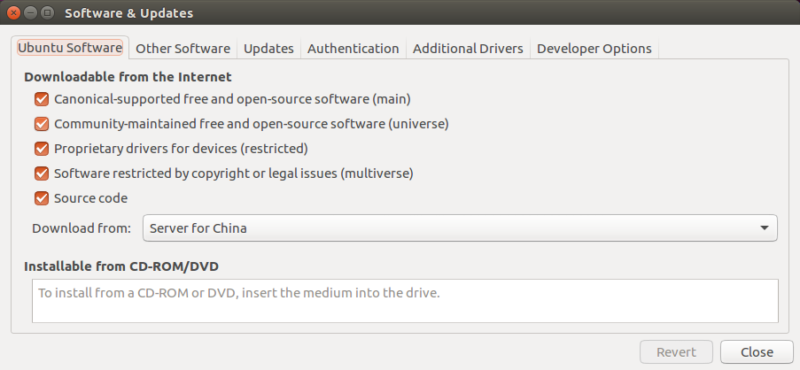
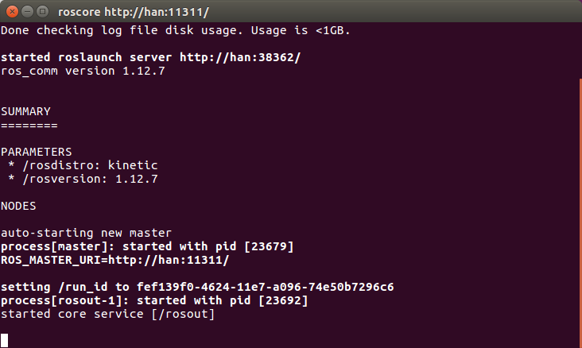
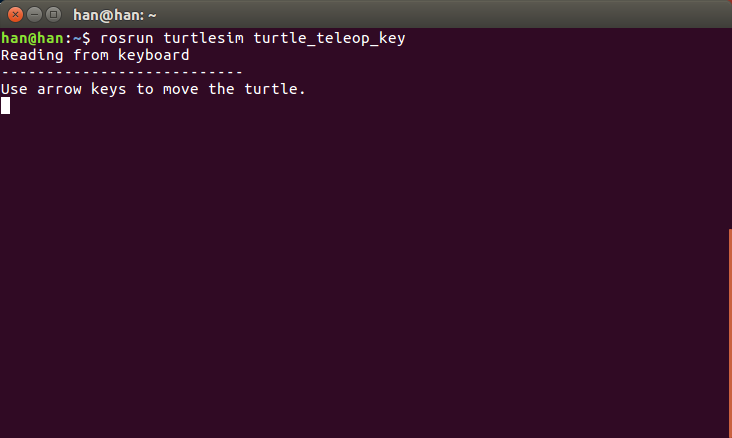
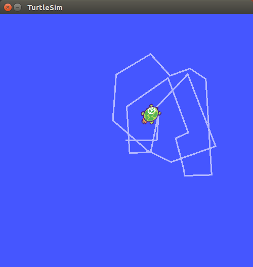
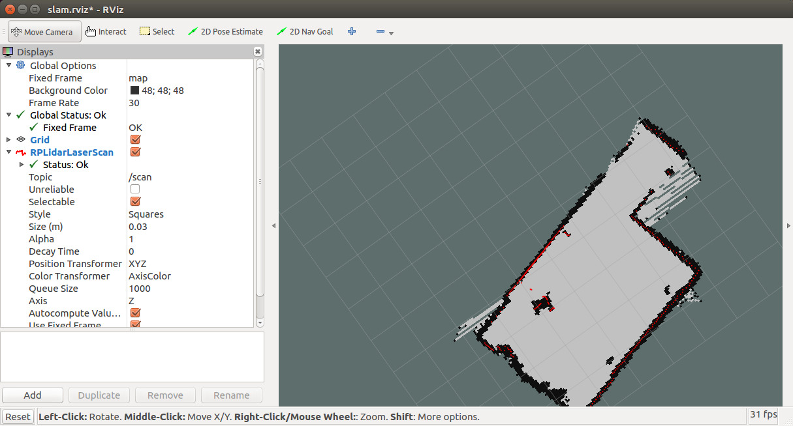

# ROS学习之路 —— 第一篇:硬件与软件配置

## ROS安装

本文档的示例均在Ubuntu 16.04 LTS环境下，此版本的Linux系统适配

ROS Kinetic, 如果你用的是Ubuntu 14，则需要适配Ros indigo，只需

将此文档中的Kinetic版本换成indigo即可

首先假定已经安装好Ubuntu系统，下面首先安装ROS:

安装教程在ROS Wiki官网上也能找到:[ROS Wiki](http://wiki.ros.org/kinetic/Installation/Ubuntu)

1. **配置Ubuntu软件更新中心**

一般来说，Ubuntu默认是配置好的，但是最好检查一下,正常配置好如下:

2. **添加source.list**

    sudo sh -c 'echo "deb http://packages.ros.org/ros/ubuntu $(lsb_release -sc) main" > /etc/apt/sources.list.d/ros-latest.list'

3. **添加keys**

    sudo apt-key adv --keyserver hkp://pool.sks-keyservers.net --recv-key 421C365BD9FF1F717815A3895523BAEEB01FA116

4. **更新环境**

这一步是为了使自己的系统环境最新，以便支持ROS的需求和功能

    sudo apt-get update

5. **安装ROS**

利用常规的apt-get方法来对ROS进行安装:

    sudo apt-get install ros-kinetic-desktop-full

注意，上面是安装kinetic版本，如果适配的是其它版本，则只需将kinetic修改

即可

6. **初始化rosdep**

    sudo rosdep init
    rosdep update

7. **环境配置**

这一步是为了使ROS在系统启动时能够自动配置好，打开终端即可用

    echo "source /opt/ros/kinetic/setup.bash" >> ~/.bashrc
    source ~/.bashrc

第一句将启动项写入.bashrc文件，也就是每次终端启动时加载的文件，第二句

刷新终端，也可以重新打开终端，也能得到一样的效果

8. **安装rosinstall**

方便以后下载相关源码

    sudo apt-get install python-rosinstall

--------------------------------------------------------------------

# ROS学习之路--第二篇: 运行小海龟

小海龟是ROS的一个示例程序，下面说明如何运行起来此程序

1. **启动ROS**

首先打开一个终端(Ctrl+Alt+t)，输入命令

    roscore

最终会提示已经启动，如果失败，则需检查ROS安装是否正确

2. **显示小海龟界面**

新打开一个终端, 输入以下命令，调出小海龟的界面:

    rosrun turtlesim turtlesim_node

3. **键盘控制小海龟运动**

这一步使用键盘上的箭头来控制小海龟的运动

    rosrun turtlesim turtle_turtleop_key

运行示例如下：

至此，我们就已经进入ROS的神奇世界，让我们继续我们的ROS之旅

----------------------------------------------------------------

# ROS学习之路--第三篇TurtleBot硬件及软件配置

我的ROS硬件设备主要有:Kobuki机器人移动底座,kinect1，rplidar激光雷达

**首先介绍Kobuki的配置方法:**

在安装好ROS之后，可以看到ROS所支持的机器人列表，搜索kobuki，如下:

    apt-cache search ros-kinetic-kobuki | less

可以看到一系列的关于Kobuki的软件包，可用apt-get方法安装

    sudo apt-get install ros-kinetic-kobuki ros-kinetic-kobuki-core

安装完成之后，即可用来驱动kobuki机器人，另外，ros可选包里也有turtlebot

的相关包，可以直接安装上，刚开始怕出错，所以顺便也将这个包安装了,安装教程

同样可以在ROS Wiki 官网找到[ROS-Wiki-Turtlebot](http://wiki.ros.org/turtlebot/Tutorials/indigo/Turtlebot%20Installation)

    sudo apt-get install ros-kinetic-turtlebot ros-kinetic-turtlebot-apps ros-kinetic-turtlebot-interactions ros-kinetic-turtlebot-simulator ros-kinetic-kobuki-ftdi ros-kinetic-rocon-remocon ros-kinetic-rocon-qt-library ros-kinetic-ar-track-alvar-msgs

现在驱动Kobuki底座的软件包已经安装好，下面就开始测试

首先用USB线将Kobuki连接到电脑,将Kobuki电源打开，灯会亮，而且会有提示声音,

然后的流程就跟小海龟的例子相似:

打开终端，首先运行ros服务:
    
    roscore

新打开一个终端，启动turtlebot:

    roslaunch trutlebot_bringup minimal.launch

再打开一个终端,启用电脑上的键盘控制

    roslaunch turtlebot_teleop keyboard_teleop.launch

根据提示，通过键盘使底座运动，i是前进

**然后介绍Kinect的配置**

Kinect分为1和2,我这里使用的是Kinect1,原理上应该是一样的，Kinect需要外接电源

供电标准为12V,1.5A,在Kobuki底座上有相应的接口,kinect的USB端口需要连接到电脑

上，以便电脑能够驱动而且能够将图像传输到电脑

首先下载openni_kinect驱动,相应的方法在ROS官网也能找到[openni_kinect](http://wiki.ros.org/openni_kinect)

    sudo apt-get install ros-kinetic-openni-camera ros-kinetic-openni-launch

上面完成之后，可以对Kinect进行测试:

RGB图像:

运行Kinect节点:

    roslaunch rbx1_vision openni_node_kinetic.launch

新打开终端

    rosrun image_view image_view image:=/camera/rgb/image_color

深度图像:

运行Kinect节点(经过试验,此步骤必须):

    roslaunch openni_launch openni.launch

新打开终端

    rosrun image_view diparity_view image:=/camera/depth/disparity

即可看到深度图像

**rplidar驱动及测试**

rplidar的驱动也能在ros程序包列表里找到，下面输入安装命令

   sudo apt-get install ros-kinetic-rplidar-ros

安装完成之后即可进行测试，如下：

连接rplidar到电脑的USB接口，然后查看接口号:

    ls -l /dev | grep ttyUSB

一般来说，如果只有rplidar连接，都是ttyUSB0，但最好也检查一下

然后改变ttyUSB0的权限，提供写权限:

    sudo chmod 666 /dev/tty/USB0

启动rplidar，并在rviz三维视窗内查看扫描结果

    roslaunch rplidar_ros view_rplidar.launch

查看rplidar节点

    roslaunch rplidar_ros rplidar.launch

最后理想的情况应该是rplidar终端不报错，显示出status=0，并且在rviz中能够看到

细微的扫描图像，以红色线标出

可能存在的问题:当多个设备同时连接，比如我这里连接了三个设备时，有可能出现

问题，最主要的就是新添的接口需要重新设置权限，可以先运行

    ls -l /dev | grep ttyUSB

命令查看都有哪些接口以及接口相应的权限，将其都设置成666模式

-------------------------------------------------------------------------

# ROS学习之路--第四篇:利用rplidar构建地图

在像无头苍蝇一样摸索一天，一遍遍地测试网上示例命令无果之后，决定去请教同事，

ROS资深专家，柴常坤.  在他的耐心指导下，终于摸到了点门道，至少，感觉才入了

门. 首先，我的rplidar之前就能正常驱动，但是无法像网上教程一样建立地图，因此

这里，在进行此示例之前，请确保你的rplidar驱动是正常的.

另外，我之前的问题是rplidar显示出来是一系列的红点，或者称为红线，移动rplidar

时只是红色边界发生变化，但是没有建图界面,第一次是因为我以为只要运行

    roslaunch rplidar_ros view_rplidar.launch

命令就万事大吉了，其实大错特错，这个命令只是让rplidar的扫描可视化，并没有

启动建图程序，如果要看到建图过程，还需要运行建图命令，网上看到几个不同的

建图命令，hector-mapping, gmapping, slam等等，因为我是菜鸟，所以面对这么多命令

一片茫然，也不知道到底那个是我想要的，一个个运行了还一大堆错误，然后查找了一下

ROS可用的支持包，用如下命令搜索所有带有上面字眼的可用包:

    apt-cache search *mapping
    apt-cache search slam

然后用apt-get install方法把所有带上面字样的包都一个个安装了，但是最后不

知道咋搞的，仍然报错，图也没出来，崩溃！

最后不得已，求助同事，才算解决了问题,具体解决方法如下:

首先我确实是缺少了hector-mapping相关的支持包，其次是我的所有包都是apt-get install

方法安装，这样对自己安装的东西在哪，怎么用，以及源码都没有任何了解，用起来很

不顺手，针对这两个问题，同事首先讲解怎么建自己的工作空间，然后给我从github上下载

源码编译成可执行文件，这样可以随时查看自己都有哪些可执行命令能用，不用像以前那样

死记硬背，还记不住.

**下载hector-mapping支持包**

这个不用多说，可以用如下方法安装:

    sudo apt-get install ros-kinetic-hector-mapping

然后连接并启动rplidar:

    roslaunch rplidar_ros view_hectorSlam.launch

最后得到如下扫描图:

上面中间那个黑色边界就是我啦，现在终于有了能看到成果的东西，开心开心！

注意，上面的命令是从github上面下载源码编译后的可执行文件，所在的包就是rplidar_ros

关于包的概念，可以简单理解成目录或者文件夹，下一节再讲如何正确创建并高效地管理自

己的工作空间,虽然很基础，但我自己感觉挺重要的

--------------------------------------------------------------------------------

# ROS学习之路--第五篇 创建并管理工作空间

工作空间其实就是文件夹，只不过为了方便管理和查看，将自己有关ROS的包全都放到这个

文件夹下，工作空间的创建方法可以在ROS Wiki上面查看，这里不再详述，下面主要讲下

我在学习rplidar时的过程，首先是进入工作空间下的src目录下，然后从github上将rplidar

相关的源代码克隆到本地，这里用到了git版本管理工具:

    git clone https://github.com/robopeak/rplidar_ros/tree/slam

然后会看到本地有catkin建立工作空间后应有的一些文件，还有编译好的launch文件，

    han@han:~/catkin_ws/src/rplidar_ros$ ls
    CHANGELOG.rst   launch   package.xml  rplidar_A1.png  rviz     sdk
    CMakeLists.txt  LICENSE  README.md    rplidar_A2.png  scripts  src

其中launch文件夹下保存的就是可执行文件，进入其中可以看到文件列表如下：

    han@han:~/catkin_ws/src/rplidar_ros/launch$ ls
    gmapping.launch           rplidar.launch          view_karto.launch
    hectormapping.launch      test_rplidar.launch     view_rplidar.launch
    karto.launch              view_gmapping.launch    view_slam.launch
    karto_mapper_params.yaml  view_hectorSlam.launch

可以看到有许多关于rplidar和建立地图的可执行文件，每一个文件都可以按照ROS中launch文件

的标准运行方式来运行:

    roslaunch package_name launch_file_name

这里，我们的package_name就是rplidar_ros，可执行的launch文件均在launch文件夹中列出

例如我们运行建图程序时可以键入如下命令:

    roslaunch rplidar_ros view_gmapping.launch

ROS相关的支持包的结构大体如此，因此，将它们统一起来管理，会给以后的开发带来很大方便

另外，我们是通过下载源码编译得到的可执行文件，虽然这里我们直接利用了别人的可执行文件

但是我们要知道，我们是有源码的，可以按照自己的意愿修改源码重新编译生成自己的可执行

文件，这无疑会给自己的程序带来很大的灵活性

------------------------------------------------------------------------------------

# ROS学习之路--第六篇:Kobuki底座的编程控制

之前我们已经知道怎样用键盘控制Kobuki底座的运动，但是以这样的方式控制底座的运动，我们

必须时刻拿着电脑跟着底座一起移动，给我们带来很大不便，因此我们希望能够通过编写脚本来

控制底座的运动，当然，这里只是按照事先设置好的方式运动，途中不会有任何的避障判断，尽

管如此，对于一个ROS新手来说，这已经很了不起了，因为要做到这一点，你需要事先理解好ROS

中节点(node)、话题(topic)还有消息(message)的概念，也需要知道节点之间是如何通信的，这

些我先不讲，先编写一个简单脚本使得我们能够控制底座前进或者后退，如果你愿意，也可以让

底座旋转一下. kobuki底座的运动速度分为线性(linear)速度和角(angular)速度两种. 我们通

过ros话题将控制消息发送给Kobuki，从而实现对其运动的控制，下面先回顾一下我们在之前

是如何用键盘控制Kobuki的:

    roscore
    roslaunch turtlebot_bringup minimal.launch
    roslaunch turtlebot_teleop keyboard_teleop.launch

当然，以上三个指令分别在新的终端执行，最后我们就可以用键盘控制Kobuki底座.但是现在，我们

要摆脱键盘的束缚，实现其自动行走，该如何做呢? 我们需要将速度控制指令传输给Kobuki，有一条

指令可以完成这项工作:

    rostopic pub -1 /mobile_base/commands/velocity geometry_msgs/Twist -- "[0.05,0.0,0.0]" "[0.0,0.0,0.0]"

上面这条指令可以给Kobuki一个向x方向以0.05m/s的速度前进的指令,下面稍微解释下指令的各部分

是什么意思:

    rostopic pub

这部分与ros话题的概念有关，其作用就是将一个消息发送给指定的话题

    -1

表示发送后立即退出，即为脉冲式的控制指令

    /mobile_base/commands/velocity

这个是我电脑上和Kobuki连接的ROS话题,在不同的程序或者不同的通信线路中，这个是不同的，具体

可见ROS Wiki教程里关于[ROS话题](http://wiki.ros.org/cn/ROS/Tutorials/UnderstandingTopics)的讨论.

    geometry_msgs/Twist

所发送消息的类型，关于这个请参见上面关于ROS话题的讨论

    -- "[0.05,0.0,0.0]" "[0.0,0.0,0.0]"

速度大小指令，第一部分为linear线性速度，第二部分为angular角速度，大小可以根据需要自己设置

于是我们可以初步写成如下shell程序kobuki-control

    #!/bin/bash
    # kobuki-control is a script to control automatically the movement of kobuki-base

    roscore
    roslaunch turtlebot_bringup minimal.launch
    rostopic pub -1 /mobile_base/commands/velocity geometry_msgs/Twist -- "[0.05,0.0,0.0]" "[0.0,0.0,0.0]"
    rostopic pub -1 /mobile_base/commands/velocity geometry_msgs/Twist -- "[0.05,0.0,0.0]" "[0.0,0.0,0.0]"
    rostopic pub -1 /mobile_base/commands/velocity geometry_msgs/Twist -- "[0.05,0.0,0.0]" "[0.0,0.0,0.0]"

上面重复控制指令是因为那一条指令只是脉冲式控制，底座运动一下就不再运动了，因此我们多次执行

来看效果，这个问题先不考虑，到了这里似乎我们已经大功告成了，但是当我们运行此脚本时才会发现

还有许多问题出现，首先是roscore之后的指令都没有被执行，这是因为roscore之后的指令只有等到

roscore结束之后才会执行,但是我们知道roscore运行之后会一直处于运行状态，不会结束，因此后面

的程序永远得不到执行，除非我们用Ctrl+c将其结束，后面的指令才能执行，但此时roscore停止

服务，后面的指令也就没有用了,因此，我们必须想办法解决这一问题，现在我们有两种思路

第一种: 能在shell中打开多个终端，不同的终端中运行不同的程序，这是个很自然的想法

但是，无奈，我不知道怎么操作,因此我采用了另一种思路

第二种: 也就是我采用的思路，将进程放到后台执行. 回忆之前学过的进程的知识，当我们将一个

进程放到后台执行时，我们可以在终端前台做其他事情，比如输入其它指令，执行其它脚本等等

在后台运行程序的方法有多种，我们这里采用最直接的办法:

    roscore&
    roslaunch turtlebot_bringup minimal.launch&
    rostopic pub -1 /mobile_base/commands/velocity geometry_msgs/Twist -- "[0.05,0.0,0.0]" "[0.0,0.0,0.0]"
    rostopic pub -1 /mobile_base/commands/velocity geometry_msgs/Twist -- "[0.05,0.0,0.0]" "[0.0,0.0,0.0]"
    rostopic pub -1 /mobile_base/commands/velocity geometry_msgs/Twist -- "[0.05,0.0,0.0]" "[0.0,0.0,0.0]"

这时候我们几乎要达到我们期望的结果了，但是，很不幸我在运行脚本的时候还是出了点问题，

下面三条控制消息根本传不过去，应该是指令执行太快，第二条指令执行之后，电脑与Kobuki

还未来得及建立好连接，第三条控制指令就发送过了，造成指令无法正确执行，因此，我在

第二条控制指令之后又加了一条延时指令，以便电脑和Kobuki建立连接之后再执行后面的指令,

最后的控制脚本如下:

    #!/bin/bash
    # kobuki-control is a script to control automatically the movement of kobuki-base
    roscore&
    roslaunch turtlebot_bringup minimal.launch&
    sleep 1s
    rostopic pub -1 /mobile_base/commands/velocity geometry_msgs/Twist -- "[0.05,0.0,0.0]" "[0.0,0.0,0.0]"
    rostopic pub -1 /mobile_base/commands/velocity geometry_msgs/Twist -- "[0.05,0.0,0.0]" "[0.0,0.0,0.0]"
    rostopic pub -1 /mobile_base/commands/velocity geometry_msgs/Twist -- "[0.05,0.0,0.0]" "[0.0,0.0,0.0]"

最终，我们实现了利用shell控制底座运动的目标，这离我要实现Kobuki自动绕场一周的目标又进了一步!

---------------------------------------------------------------------------

TODO
