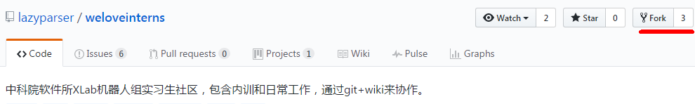
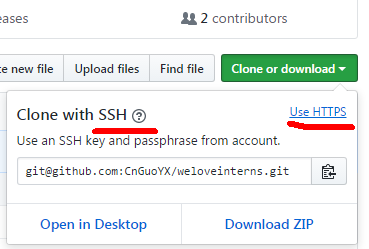
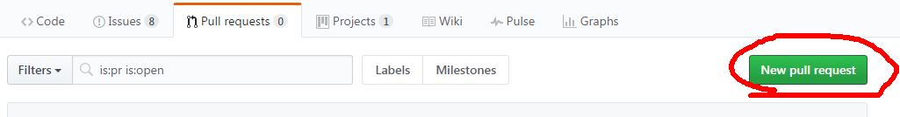
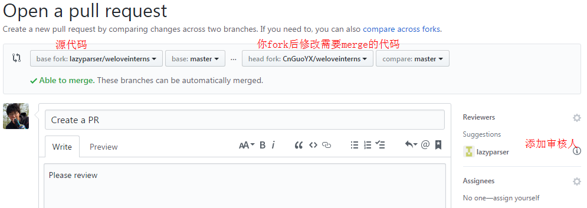

## github PR操作流程

- 组里的代码都是使用git进行版本管理，所有代码都托管在
	github上，因此每位同学首先都要注册一个github账号并完成Hello项目熟悉git操作

- 熟悉常用git命令和操作，阅读[gitbook](https://git-scm.com/book/zh/v2)

***
### PR（pull request)流程

1. **进行fork操作**

	进入需要fork的项目的github主页：
	
	点击fork按钮，即会fork一份相同代码至自己的github主页。

2. **clone代码**

	fork代码后，即可在自己的开发环境下clone代码
	clone有(https\ssh)两种方式，注意区别：
	

　　`git clone [图片中的地址]`

3. **建立分支-修改-提交到自己的代码**

	保持代码库干净整洁，养成良好习惯才能在大项目的时候减少出错。
	
	建议设置三级分支进行一个项目开发。
	
	- master分支：一个虽然在你的空间但是不要在其上进行修改、开发的分支，只用来pull,push,PR代码。
	- develop分支：一个用于自己开发的分支，可以在上进行测试、验证代码。
	- topic分支：解决问题的临时分支，完成合并到develop分支进行测试验证。
```bash
　　git checkout -b develop master
　　git checkout -b topic develop
　　#edit file in topic branch
　　#vim file.c
　　#add && commit
　　git commit -a -m "what u fixed"
　　#merge to develop|master ready to PR
　　git checkout develop
　　git merge topic
　　#push to your repo
　　git push
```

4. **github主页提交PR**
	
	
	
	
5. **等待项目维护者审核Merge**


6. **同步更新本地和github代码**
    
	当代码通过review，项目维护者Merge了我们提交的代码之后，还需要将本地仓库与你的github仓库同步更新：

```bash	
    git fetch -v --all
    git checkout master
    git pull lazyparser master
    git push origin master (optional)
```
