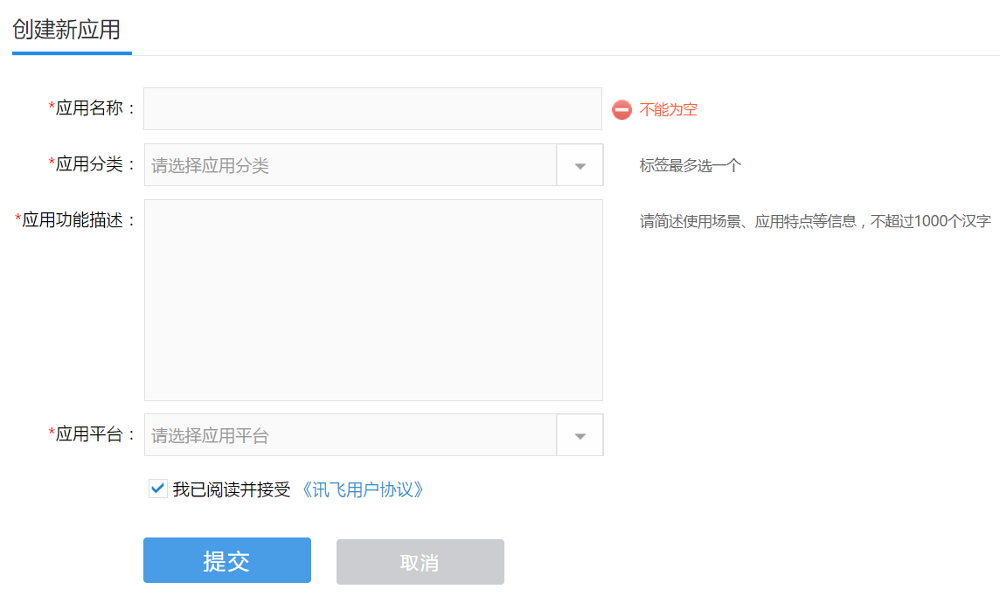
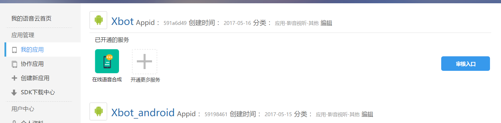
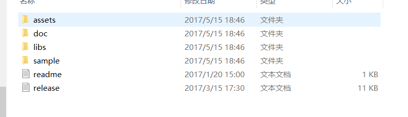
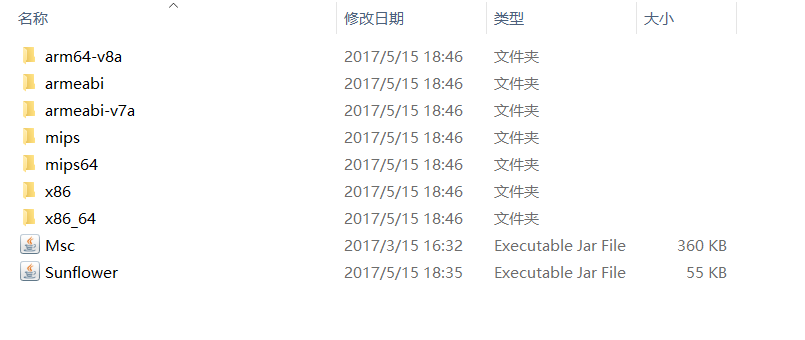
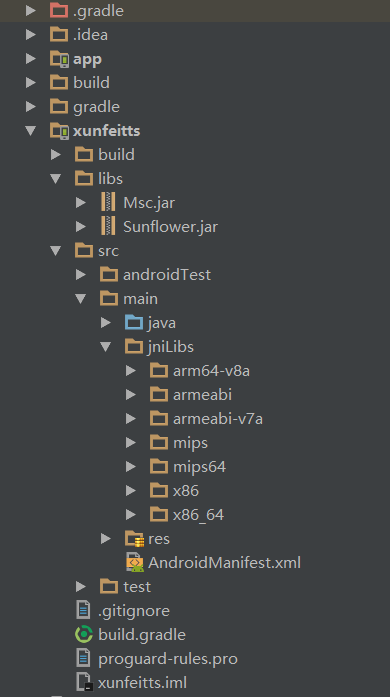

# 在Android中使用科大讯飞的在线语音合成

## 1.创建账号并成为开发者

首先在科大讯飞的[开放平台](http://www.xfyun.cn/)注册账号，然后注册成为开发者，（要输入手机号还要绑定邮箱等等），并创建一个自己的应用。

创建应用的界面如下：

填写完信息后，点击提交就创建成功了。


## 2.创建应用

创建好应用后，进入**控制台**（在讯飞网站页面的右上角），就可以看到自己刚才创建好的应用。我创建的应用名字为Xbot：



注意：这里有一个APPid，这个APPid在我们的Android代码中会用到。

## 3.下载SDK

SDK下载：

[下载地址在这里](http://www.xfyun.cn/index.php/sdk/dispatcher)

在下载页面中（页面有点长就不上图了），在“选择服务”中选择**在线语音合成**，在“选择平台”中选择**Android**，在“选择应用”中点击**刚才创建的应用**。

解压开之后，就会看到里面有如下的东西。

其中doc文件夹中是一些帮助文档和JavaDoc，sample文件夹中是一些App的代码，libs中是我们要用到的库。


在libs文件夹中有如下的文件：




这些文件夹中的是.so文件，而最下面的两个是jar包。

接下来把这些sdk导入到我们的项目中。


## 4.在Android项目中导入SDK

在Android Studio中创建一个项目。然后将讯飞的SDK导入到相应的文件夹。

如下图所示：



将Msc.jar和Sunflower.jar放在**项目的libs文件夹**，然后在这两个jar包上，鼠标右键点击，然后再点击"Add as library"，应用到当前项目中。

把那些.so库文件全部放在**项目的jniLibs文件夹**中。注意，创建项目时不会默认生成jniLibs文件夹，这个文件夹需要我们手动创建。


## 5.写代码

先看看之前下载的开发包中的文档：位于doc文件夹中的MSC Develop Manual for Android。其中告诉我们各种可以集成的功能。有些功能只是体验的，需要付费购买，有些功能可以免费使用，比如我们接下来要用到的语音合成功能。

从文档中可以知道，使用步骤如下：

1.导入SDk

2.声明权限

可以选择性的添加如下权限（根据使用的功能而决定）

```java
<!--连接网络权限，用于执行云端语音能力 -->

<uses-permission android:name="android.permission.INTERNET"/>

<!--获取手机录音机使用权限，听写、识别、语义理解需要用到此权限 -->

<uses-permission android:name="android.permission.RECORD_AUDIO"/>

<!--读取网络信息状态 -->

<uses-permission android:name="android.permission.ACCESS_NETWORK_STATE"/>

<!--获取当前wifi状态 -->

<uses-permission android:name="android.permission.ACCESS_WIFI_STATE"/>

<!--允许程序改变网络连接状态 -->

<uses-permission android:name="android.permission.CHANGE_NETWORK_STATE"/>

<!--读取手机信息权限 -->

<uses-permission android:name="android.permission.READ_PHONE_STATE"/>

<!--读取联系人权限，上传联系人需要用到此权限 -->

<uses-permission android:name="android.permission.READ_CONTACTS"/>

<!--外存储写权限，构建语法需要用到此权限 -->

<uses-permission android:name="android.permission. WRITE_EXTERNAL_STORAGE"/>

<!--外存储读权限，构建语法需要用到此权限 -->

<uses-permission android:name="android.permission. READ_EXTERNAL_STORAGE"/>

<!--配置权限，用来记录应用配置信息 -->

<uses-permission android:name="android.permission. WRITE_SETTINGS"/>

<!--手机定位信息，用来为语义等功能提供定位，提供更精准的服务-->

<!--定位信息是敏感信息，可通过Setting.setLocationEnable(false)关闭定位请求 -->

<uses-permission android:name="android.permission.ACCESS_FINE_LOCATION"/>
```

我们添加如下的权限就可以了：

```java
<uses-permission android:name="android.permission.INTERNET"></uses>

<uses-permission android:name="android.permission.RECORD_AUDIO"/>

<uses-permission android:name="android.permission.ACCESS_NETWORK_STATE"/>

<uses-permission android:name="android.permission.ACCESS_WIFI_STATE"/>

<uses-permission android:name="android.permission.CHANGE_NETWORK_STATE"/>

<uses-permission android:name="android.permission.WRITE_EXTERNAL_STORAGE"/>

<uses-permission android:name="android.permission.READ_EXTERNAL_STORAGE"/>

<uses-permission android:name="android.permission.WRITE_SETTINGS"/>
```

3.初始化

使用下面这行代码进行初始化，只有初始化后才可以使用 MSC 的各项服务。

`SpeechUtility.createUtility(context, SpeechConstant.APPID +"=12345678");`

这个**APPID**就是我们在官网上创建应用后生成的那个APPID。

4.语音合成调用示例

语音合成就是把文字信息转换为声音信息。注意这个语音合成是在线调用的服务，如果设备不能联网，则GG。（当然也可以采用缓存的方式来进行离线使用）

语音合成的调用方法如下：

```java
//1.创建 SpeechSynthesizer 对象, 第二个参数：本地合成时传 InitListener
SpeechSynthesizer mTts= SpeechSynthesizer.createSynthesizer(context, null);

//2.合成参数设置，详见《MSC Reference Manual》SpeechSynthesizer 类

//设置发音人（更多在线发音人，用户可参见 附录13.2

mTts.setParameter(SpeechConstant.VOICE_NAME, "xiaoyan"); //设置发音人

mTts.setParameter(SpeechConstant.SPEED, "50");//设置语速

mTts.setParameter(SpeechConstant.VOLUME, "80");//设置音量，范围 0~100

mTts.setParameter(SpeechConstant.ENGINE_TYPE, SpeechConstant.TYPE_CLOUD); //设置云端

//设置合成音频保存位置（可自定义保存位置），保存在“./sdcard/iflytek.pcm”

//保存在 SD 卡需要在 AndroidManifest.xml 添加写 SD 卡权限

//仅支持保存为 pcm 和 wav 格式，如果不需要保存合成音频，注释该行代码

mTts.setParameter(SpeechConstant.TTS_AUDIO_PATH, "./sdcard/iflytek.pcm");

//3.开始合成

mTts.startSpeaking("科大讯飞，让世界聆听我们的声音", mSynListener);

//合成监听器

private SynthesizerListener mSynListener = new SynthesizerListener(){

//会话结束回调接口，没有错误时，error为null

public void onCompleted(SpeechError error) {}

//缓冲进度回调

//percent为缓冲进度0~100，beginPos为缓冲音频在文本中开始位置，endPos表示缓冲音频在

文本中结束位置，info为附加信息。

public void onBufferProgress(int percent, int beginPos, int endPos, String info) {}

//开始播放

public void onSpeakBegin() {}

//暂停播放

public void onSpeakPaused() {}

//播放进度回调

//percent为播放进度0~100,beginPos为播放音频在文本中开始位置，endPos表示播放音频在文

本中结束位置.

public void onSpeakProgress(int percent, int beginPos, int endPos) {}

//恢复播放回调接口

public void onSpeakResumed() {}

//会话事件回调接口

public void onEvent(int arg0, int arg1, int arg2, Bundle arg3) {}

};
```


以上就是如何在Android中使用科大讯飞的在线语音合成，同理，当然还可以在Android中集成其他的服务。

从MSC目录中可以看到，还可以集成如下的许多功能：


​						by--- [lisongting](https://github.com/lisongting)

