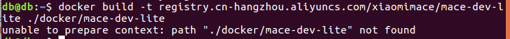

#mace
以下为我跟着小米开源的mace所做的一些工作
##setup
首先是安装所需的环境
###python
使用linux自带的python2.7即可
###Bazel（建议第一种，安装在哪里都好找）<https://docs.bazel.build/versions/master/install-ubuntu.html>

`apt-get install cmake`
`pip install -I jinja2==2.10`

`pip install -I pyyaml==3.12`

`pip install -I sh==1.12.14`

`pip install -I numpy==1.14.0`
###docker
pull`docker pull registry.cn-hangzhou.aliyuncs.com/xiaomimace/mace-dev-lite`
build`docker build -t registry.cn-hangzhou.aliyuncs.com/xiaomimace/mace-dev-lite ./docker/mace-dev-lite`但是
%%所以首先：创建Dockerfile。

	# Create a container named `mace-dev`
	docker run -it --privileged -d --name mace-dev \
        	   -v /dev/bus/usb:/dev/bus/usb --net=host \
        	   -v /local/path:/container/path \
        	   registry.cn-hangzhou.aliyuncs.com/xiaomimace/mace-dev-lite
	# Execute an interactive bash shell on the container
	docker exec -it mace-dev /bin/bash
另：使用sudo命令解决

###caffe 
caffe.berkeleyvision.org/installation.html
###Install Android NDK

	# Download NDK r15c
	cd /opt/ && \
   	 wget -q https://dl.google.com/android/repository/android-ndk-r15c-linux-x86_64.zip && \
	    unzip -q android-ndk-r15c-linux-x86_64.zip && \
	    rm -f android-ndk-r15c-linux-x86_64.zip
很有可能运行上述命令很快结束，有坑并没有中途出了问题，建议一条条运行，如遇权限不足，使用`sudo`。
环境变量,用于解决的问题

	export ANDROID_NDK_VERSION=r15c
	export ANDROID_NDK=/opt/android-ndk-${ANDROID_NDK_VERSION}
	export ANDROID_NDK_HOME=${ANDROID_NDK}
	# add to PATH
	export PATH=${PATH}:${ANDROID_NDK_HOME}
###Install extra tools

	apt-get install -y --no-install-recommends cmake android-tools-adb
	pip install -i http://pypi.douban.com/simple/ --trusted-host pypi.douban.com setuptools
	pip install -i http://pypi.douban.com/simple/ --trusted-host pypi.douban.com \
	    "numpy>=1.14.0" \
	    scipy \
	    jinja2 \
	    pyyaml \
	    sh==1.12.14 \
	    pycodestyle==2.4.0 \
	    filelock
###Install TensorFlow (Optional)
	
	pip install -i http://pypi.douban.com/simple/ --trusted-host pypi.douban.com tensorflow==1.6.0
这个tensorflow的内部函数比较少，使用pip安装也不好更改，建议使用源码安装，或者像我另一片教程所说，clone一个完整的tensorflow，见GraphTransformTool.md
##basic usage
###如何快速使用 MACE Model Zoo中提供的model
####1.pull mace project

	git clone https://github.com/XiaoMi/mace.git
进入clone 的mace的目录（进行git的相关操作，一定要进入这个库）
	
	git fetch --all --tags --prune
	# Checkout the latest tag (i.e. release version)
	tag_name=`git describe --abbrev=0 --tags`
	git checkout tags/${tag_name}

####2.pull mace model zoo project 

	git clone https://github.com/XiaoMi/mace-models.git
####3.build a generic mace library
首先进入mace库中`cd path_to_mace_of_yours`
之后，最好更新一下你clone的库`git remote prune origin`，不然有的文件是不存在的，和github上的库可能略有不同。bash下列文件即可(此文件位于master分支，`git checkout master`)

	bash tools/build-standalone-lib.sh

####4.Convert the pre-trained mobilenet-v2 model to MACE format model.
使用`converter.py`将`.pb`格式的模型转化为mace下的
	
	python tools/converter.py convert --config ~/mace_git/mace-models/mobilenet-v2/mobilenet-v2.yml

进行试运行，可以使用

	python tools/converter.py run --config ~/mace_git/mace-models/mobilenet-v2/mobilenet-v2.yml --example
测试时间，使用
	
	python tools/converter.py run --config ~/mace_git/mace-models/mobilenet-v2/mobilenet-v2.yml --round 1000
结果

cpu

gpu

cpu

gpu

比较结果（原始模型和框架，用余弦距离测量相似度。）使用

	python tools/converter.py run --config ~/mace_git/mace-models/mobilenet-v2/mobilenet-v2.yml --validate
结果如图所示
abi：armeabi-v7a

abi：arm64-v8a

以上结果，我都是使用的手机honor8进行的测试。开启手机开发者选项，进行usb调试即可。
####5.your own model(.pb)
本节主要介绍yaml文件的具体内容，从上节可以看出，对不同模型的不同操作，都要使用`.yml`文件，所以，对它的理解尤为重要,在<https://mace.readthedocs.io/en/latest/user_guide/advanced_usage.html >中可以查看具体参数信息。下面介绍比较重要的几个
建立yaml文件，后缀.yml。内容

	# The name of library
	library_name: mobilenet
	target_abis: [arm64-v8a]
	model_graph_format: file
	model_data_format: file
	models:
	  classify: # model tag, which will be used in model loading and must be 	specific.
	    platform: tensorflow
	    # path to your tensorflow model's pb file. Support local path, http:// and https://
	    model_file_path: /home/db/mace/tensorflow/optimized_classify_graph.pb
	    # sha256_checksum of your model's pb file.
  	  model_sha256_checksum: 30310d037c84622a49eec2b94690b088c1d89c44089f204bc95cc819d15323d4
	    # define your model's interface
	    # if there multiple inputs or outputs, write like blow:
	    # subgraphs:
	    # - input_tensors:
  	  #     - input0
  	  #     - input1
  	  #   input_shapes:
  	  #     - 1,224,224,3
  	  #     - 1,224,224,3
  	  #    output_tensors:
  	  #      - output0
   	 #      - output1
	    #    output_shapes:
	    #      - 1,1001
	    #      - 1,1001
	    subgraphs:
	      - input_tensors:
	          - input
	        input_shapes:
	          - 1,224,224,3
	        output_tensors:
	          - classify/Predictions/Reshape_1
	        output_shapes:
	          - 1,1001
	    # cpu, gpu or cpu+gpu
	    runtime: cpu
	    winograd: 0
其中，target_abis:选择运行的ABI，可以是  'host', 'armeabi-v7a' or 'arm64-v8a'，也可以多选，用‘，’隔开
要得到sha256 checksum，可以使用下列命令，这是为了文件传输安全准确

	openssl dgst -sha256 filename
	#or
	shasum -a 256 filename
`model_file_path`，值得注意的是本地文件不能使用‘~/....’的格式，而应该使用`/home/db/...`代替‘～’的作用，其中db是我的用户名，你应该换成自己的。
###得到apk安装包
#####1. androidstudio
1.下载linux版本studio，地址<http://www.androiddevtools.cn/>
android-studio-ide-171.4408382-linux.zip
解压
unzip android-studio-ide-171.4408382-linux.zip
2.运行软件

	 ./bin/studio.sh
即可安装成功androidstudio。
####2.bash mace中的文件
还可以进去mace库中`mace/example/android`运行

	./build.sh

我本来打算将mace的apk也demo出来，但是可惜运行后得到的apk文件安装后闪退，尚未解决。
####3.
将mace库全部还原，在电脑上连接自己的android，我的是华为荣耀八，打开开发者模式，usb调试。运行上节内容，可以得到手机上的app。运行时可能下载模型时速度过慢乃至进程不动，建议按照之前yaml文件的内容将模型路径改为本地。这个android的yaml文件是`mace/example/android`中的`mobilenet.yml`。
将其中的`model_file_path`的网址中的模型手动下载，在将网址改为本地地址即可。

手机app界面

曹宁宁