# Tensorflow-YOLO in Android 调研报告 

by -- [paperfish](#https://github.com/lisngting)

YOLO是一个用于物体识别的模型，它的源码是位于这里：[https://github.com/gliese581gg/YOLO_tensorflow](#https://github.com/gliese581gg/YOLO_tensorflow) ，[android-yolo](#https://github.com/natanielruiz/android-yolo) 是一个使用了tensorflow框架+yolo模型的App。

作者在android-yolo的README中是这样说的：
>android-yolo is the first implementation of YOLO for TensorFlow on an Android device. It is compatible with Android Studio and usable out of the box. It can detect the 20 classes of objects in the Pascal VOC dataset: aeroplane, bicycle, bird, boat, bottle, bus, car, cat, chair, cow, dining table, dog, horse, motorbike, person, potted plant, sheep, sofa, train and tv/monitor.

我一开始看了一下他这个App的[视频](#https://www.youtube.com/watch?v=EhMrf4G5Wf0&feature=youtu.be) ，下面是一张视频里的截图：

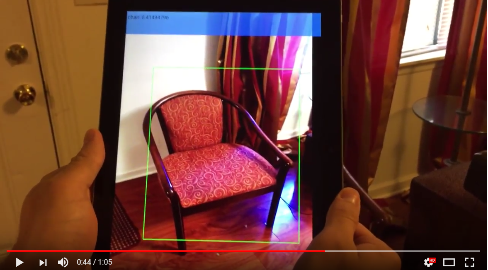 


尽管作者说只能支持20个物体，然而看到视频中的效果，感觉识别得还不错，于是打算先尝试在一个测试app中试一试能否移植过来，如果能移植成功并且效果不错的话，然后再集成到xbot_head中。(只要能移植成功，后续的集成就很方便。)

由于tensorflow底层是用C++实现的，因此我在Android端就得借助[JNI(Java Native Interface)](#https://developer.android.com/training/articles/perf-jni.html?hl=zh-cn) 和[NDK(Native Development Kit)](#https://developer.android.google.cn/ndk/index.html) 。

然后我的探索之路 ~~入坑之路~~ 就开始了-----

## 漫长的探索之路 

探索之路分为如下几个阶段：

* C++源码编译so库，编译不通过
* 源码编译通过，运行起来找不到native方法
* 运行起来找到native方法，但是native方法中报异常
* native方法异常解决，图像识别和计算数值异常
* 计算数值异常解决。能大致识别出物体位置

### 1.编译不通过 

我首先把整个原项目——android-yolo都clone到本地，用Android Studio先打开研究研究，

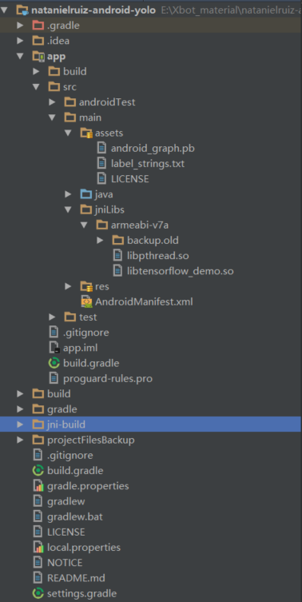

这个项目中用了jniLibs中的两个so动态链接库，然后还有assets中的几个文件，下面的jni-build是so库的C++源码。

我就想，既然都提供了so库，那就直接先拿过来试试，出于测试目的，java代码也是复用了android-yolo中的。

我新建了一个项目，把so库，java代码和asset文件都拷进入了，然后插上手机，一点击运行，马上闪退了：

异常如下（为了恢复“案发现场”，这张图是我写报告时才模拟“案发情景”截图的，当时忘记截图了）：

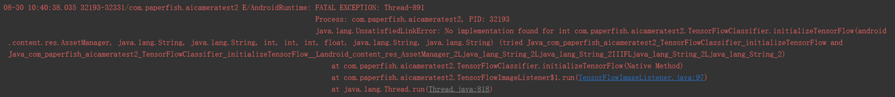

这个错误的意思就是：Java中调用了native方法，但是找不到native方法的具体实现。

在97行调用了这样一行代码：

`int initCode = tensorflow.initializeTensorFlow(assetManager, MODEL_FILE, LABEL_FILE, NUM_CLASSES, INPUT_SIZE, IMAGE_MEAN, IMAGE_STD,INPUT_NAME, OUTPUT_NAME);`

`initializeTensorFlow` 是一个已声明的`native`方法：
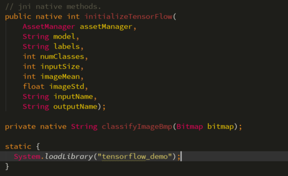

native方法并不在Java中进行实现，而是在C/C++中进行实现（这也就是JNI可以跨平台的原因），同样`classifyImageBmp` 也是native方法，用于对传入的Bitmap进行物体识别。下面有一行`System.loadLibrary("tensorflow_demo")` ，意思是在类初始化的时候去加载libtensorflow_demo.so库(前缀lib和后缀.so可不用写)。 

既然我用他提供给我的so库，访问却报错，那这条路走不通，就换条路走：先看看C++代码是怎么写的。


我看到有一个`Android.mk` 和`Application.mk` ，说明这个JNI库用`Android NDK` 编译的。（当时花了些时间好好看了看NDK和相关的编译规则，才算把Android.mk和Application.mk搞懂。）

那么我先用`ndk-build` 来编译一下：

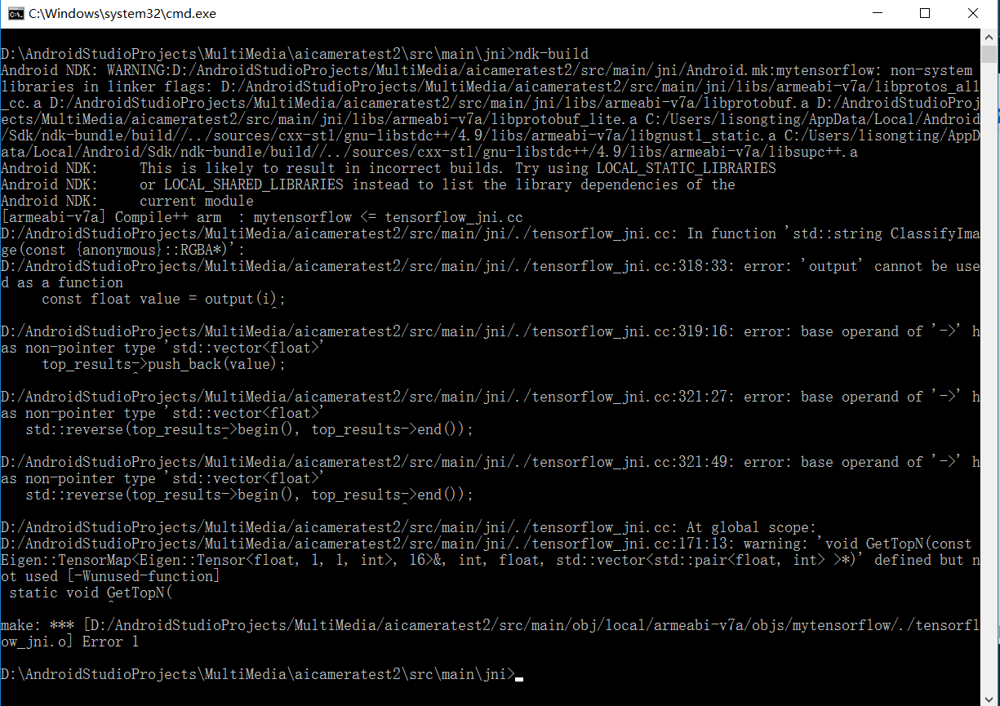

**吃惊，居然源码编译都会报错** ？？

不知道android-yolo的作者natanielruiz是用了怎样的方式编译通过的，为此我还在android-yolo上面提了一个issue。

后来经过各种探索，发现tensorflow官方的一个独立demo：[miyosuda/TensorFlowAndroidDemo](#https://github.com/miyosuda/TensorFlowAndroidDemo) ，仔细看了看之后发现，原来这个TensorFlowAndroidDemo和natanielruiz的android-yolo中用的是几乎一样的C++代码，文件名和文件结构都是一样的。于是我把TensorFlowAndroidDemo中的库编译了一遍，这个却又可以编译通过。

我就猜想一定有哪些地方被改过了，否则android-yolo中的C++代码怎么可能编译不通过。

仔细观察之后发现，原来，`tensorflow_jni.cc` 这个文件被natanielruiz改过了。下面是对比图：

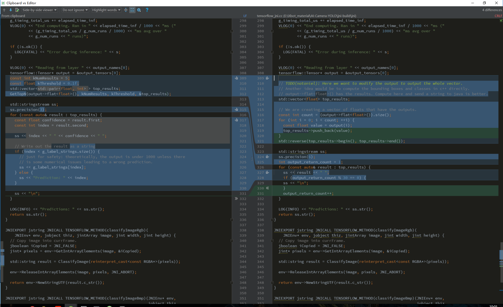

左边的是TensorFlowAndroidDemo中的`tensorflow_jni.cc`，右边的是android-yolo中改过的`tensorflow_jni.cc` 。这就比较尴尬了：natanielruiz把代码改动过，结果导致编译不通过。(至于他是怎么编译通过的，可能只有他自己知道了吧。滑稽) 

我看他改的这个代码，大致是这个意思：先调用output的`flat()` 函数，指定泛型为float，得到一个count，这个count估计是一个泛型容器的大小，output这里是一个指向`tensorflow::Tensor` 的指针。最关键是出错的这一行代码：for循环里的`output(i)`  , 由于上面已经有一个指针叫做output，他这里又把output当做函数来用（估计他是想取出调用`flat()` 之后得到的泛型容器中的每一个float的值 ）。所以才导致报错，而且他后面还犯了`top_results->` 这种错，因为`top_results` 并不是指针。


我根据他的意思，仔细看看了相关代码，后来把他这个代码片段改成了这样：

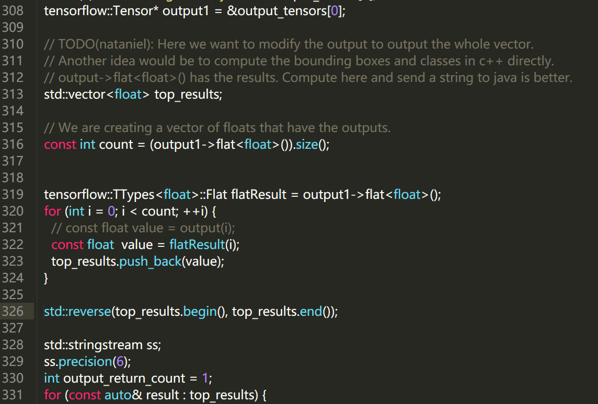


这次我再编译，没有报错了。生成了so库。


### 2.找不到native方法 

我把自己的测试app中的so库换成新的，然后再次运行：

结果又闪退了。还是找不到native方法~ ~ ~ ~ ~ 

冥思苦想之后，又看了一堆文档，忽然想起jni中有一条这样的规则：**C/C++中需要提供给Java层调用的方法，必须要以`Java_[包名]_[类名]_[方法名]` 这样的方式定义** 。

然后我看了看，果然找到端倪，在tensorflow_jni.h中，`TENSORFLOW_METHOD` 这个宏和`org.tensorflow.demo` （包名）中的`TensorFlowClassifier` 类绑定了，也就是说，只有org.tensorflow.demo中的TensorFlowClassifier能访问下面的`initializeTensorFlow` 和 `classifyImageBmp ` 函数。

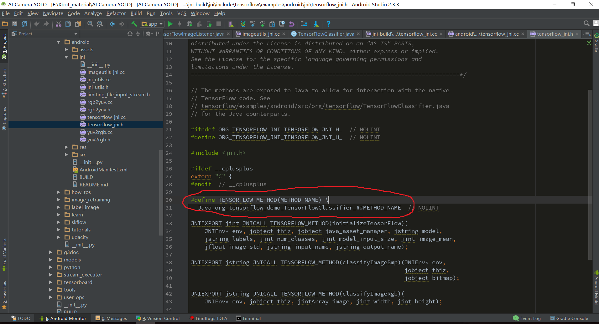

那么我就明白该怎么做了，我要想在自己的项目中移植这个so库，那么我需要把上面这类方法全部替换为我自己的`[包名]_[类名]_[方法名]`  的形式。替换完成后就像这样：

```
//宏函数
#define TENSORFLOW_METHOD(METHOD_NAME) \
  Java_com_paperfish_aicameratest2_TensorFlowClassifier_##METHOD_NAME  // NOLINT
```

我的包名是：com.paperfish.aicameratest2，类名是TensorFlowClassifier 。

其他的还有几处，这里就不一一列出了。

替换完成后，编译。

编译通过！！！。

（我还以为：走完这几个坑，后面都平坦了，然而。。。。）

### 3.native方法抛异常 

将编译好的so库再次替换到我自己的测试项目中，运行：结果APP刚运行几秒种，就报错闪退了。

查看了一下错误信息：

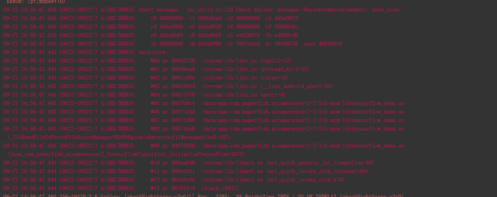

哇，这底层代码居然也会报异常，我开始严重怀疑底层代码到底可不可靠？？太坑了吧

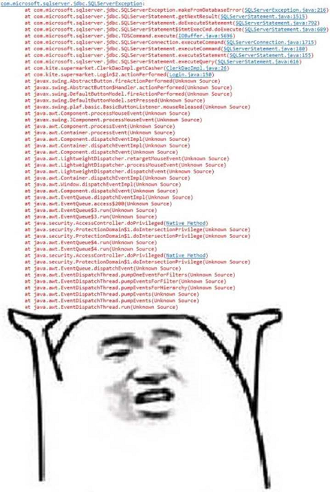

这个阶段又挣扎了好久。


后来查了很多文档后发现，底层代码尝试读取Asset中的资源文件时，如果资源文件被aapt工具压缩了，则在底层读取的时候会报错。

于是我在build.gradle中添加了如下的配置：
```
aaptOptions {
        noCompress 'pb'
    }
```

加上这个配置，让aapt工具不要对pb文件压缩，如果压缩了之后在C++代码中读取Asset文件会报错。

再次运行，果然问题解决！！

（前面这几个阶段真的是苦苦挣扎，折磨了好久，周六在一位大神学长的帮助下才算有了些头绪）


### 4.物体位置识别错误

经过前面的一番探索，运行能访问native方法了，并且底层代码也不报错了。

然而又出现了一个新的问题：识别物体时，只能够识别出大致物体名，但是位置框却没有能够正常显示。

于是尝试着从log分析分析：

这个是android-yolo中，正常画出物体位置框时，我自己打印的log：

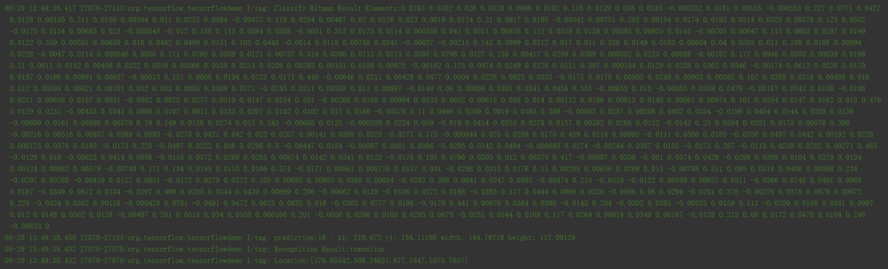

当在Java代码中调用`classifyImageBmp(Bitmap bitmap)` 这个native方法时，会返回一长串String，这个String由很多个数字组成，这个可能是跟深度学习的一些计算有关，看不懂。然后又会根据这些返回的数字，计算出物体的位置。比如根据这上面的这些数字，最后计算出的物体的位置为：**Location:[179.05542,509.24637,877.1847,1073.7937] ** ，四个元素分别为矩形的左、上、右、下坐标，这是一个正常的矩形。

左上右下坐标的说明：

```
* @param left   The X coordinate of the left side of the rectangle
* @param top    The Y coordinate of the top of the rectangle
* @param right  The X coordinate of the right side of the rectangle
* @param bottom The Y coordinate of the bottom of the rectangle
```


在我的测试项目中，不能正常画出物体的位置框。查看log为：

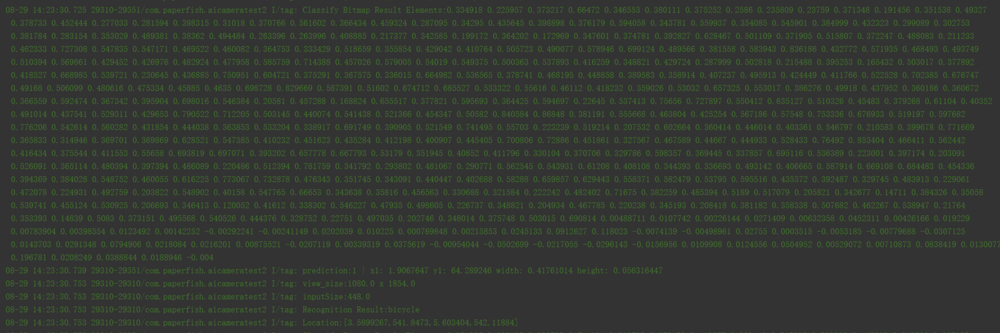

在最后面打印出的一个Location为：Location:[3.5899267,541.8473,5.603404,542.11884] 。这显然是一个不正常的矩形。非常小。


遇到这个问题，当时想的是，要么是Java代码出错，要么是底层C++代码计算错误。Java代码不可能出错，因为我的测试app中的代码是和android-yolo中几乎一样的。那应该就是C++代码出错了。

再次查看和android-yolo中的这个`tensorflow_jni.cc` :

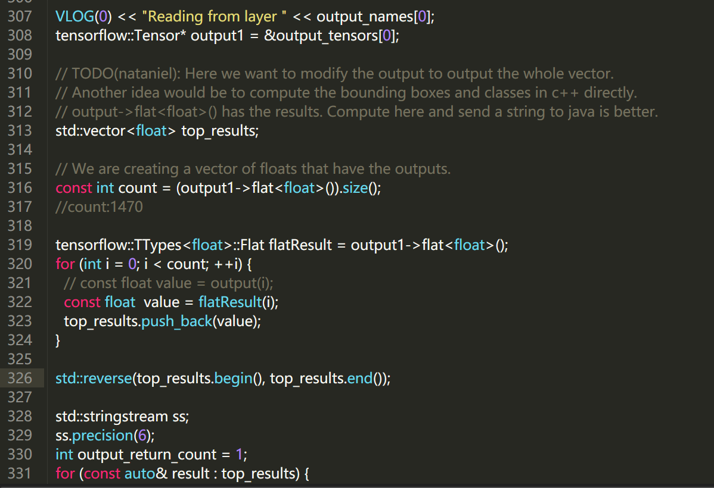

这个是TensorFlowAndroidDemo中的`tensorflow_jni.cc` ：

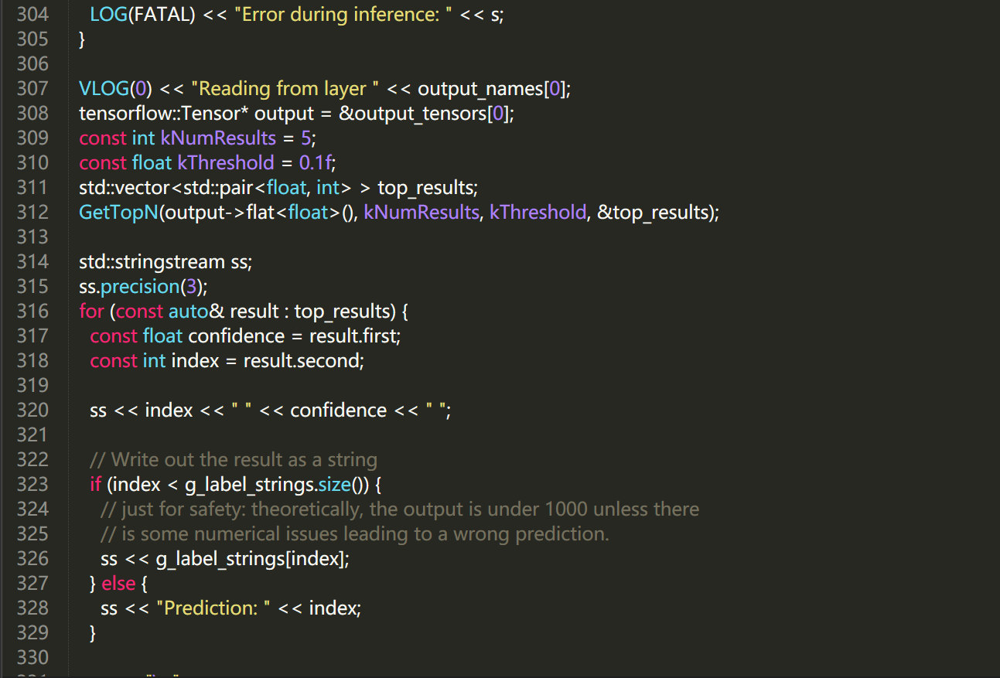

将这个tensorflow_jni.cc和原来TensorFlowAndroidDemo中的`tensorflow_jni.cc`对比之后发现，原来的TensorFlowAndroidDemo中的`tensorflow_jni.cc` 在`ClassifyImage` 的时候调用了一个`GetTopN` 函数：

```c++
// Returns the top N confidence values over threshold in the provided vector,
// sorted by confidence in descending order.
static void GetTopN(
    const Eigen::TensorMap<Eigen::Tensor<float, 1, Eigen::RowMajor>,
                           Eigen::Aligned>& prediction,
    const int num_results, const float threshold,
    std::vector<std::pair<float, int> >* top_results) {
  // Will contain top N results in ascending order.
  std::priority_queue<std::pair<float, int>,
                      std::vector<std::pair<float, int> >,
                      std::greater<std::pair<float, int> > >
      top_result_pq;

  const int count = prediction.size();
  for (int i = 0; i < count; ++i) {
    const float value = prediction(i);

    // Only add it if it beats the threshold and has a chance at being in
    // the top N.
    if (value < threshold) {
      continue;
    }
    top_result_pq.push(std::pair<float, int>(value, i));

    // If at capacity, kick the smallest value out.
    if (top_result_pq.size() > num_results) {
      top_result_pq.pop();
    }
  }
  // Copy to output vector and reverse into descending order.
  while (!top_result_pq.empty()) {
    top_results->push_back(top_result_pq.top());
    top_result_pq.pop();
  }
  std::reverse(top_results->begin(), top_results->end());
}
```


这个`GetTopN` 的意思是：找到前N个confidence最大的元素，放在top_results容器中。最后调用了`std::reverse(top_results->begin(), top_results->end());` 方法，`std::reverse` 意思就是将top_results中的元素倒序排列。

再次观察android-yolo中的这个`tensorflow_jni.cc` : ,发现在他里面全程没有使用`GetTopN` ，但是却使用了`std::reverse(top_results.begin(), top_results.end());` ，仔细分析之后感觉有点怪异。

反正我尝试了很多种改法都没有成功，那就再尝试一次，干脆把这个`std::reverse(top_results.begin(), top_results.end());` 去掉，看看能否成功。

我将`std::reverse(top_results.begin(), top_results.end());` 去掉之后，再次生成新的so库，放在我的测试项目中，运行。

貌似运气不错，成功了！！！


尽管识别的位置还有一些差距，但是整体矩形框还是画出来了，说明我自己的测试项目中已经可以成功移植并运行tensorflow-yolo。至于识别精度和位置差别，这是开源框架算法和模型的要做的事了。

漫长的探索旅程终于Over.


## 一些体会

 在这个探索的过程中，确实遇到很多麻烦。jni和ndk的东西确实有点坑，现在写出来，虽然从头到尾看上去都很流畅，一个问题接一个问题，对应一个解决方法加另一个解决方法。然而这个过程却并非走得那么顺利，一度想放弃。有时自己弄了半天，刚解决一个问题，马上又出另一个问题，感觉心态要炸。对JNI和NDK的东西更加熟悉了一些，以后遇到类似的问题就跟得心应手了。


