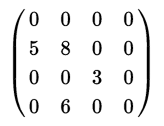
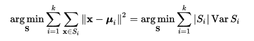

# Deep Compression
这篇文章来自2016ICLR最佳论文：[[Han2016A]Deep Compression: Compressing Deep Neural Networks with Pruning, Trained Quantization and Huffman Coding](https://arxiv.org/abs/1510.00149)。作者是Han Song，中国人，斯坦福博士。
作者15年发过一篇相关的文章：[[Han2015A]Learning both weights and connections for efficient neural networks](http://dl.acm.org/citation.cfm?id=2969366)。Deep Compression扩展了这一篇文章。
## 相关资源
github上有一个作者提供的压缩AlexNet的[model](https://github.com/songhan/Deep-Compression-AlexNet) ，用的caffe。
[这里](https://youtu.be/vouEMwDNopQ) 有作者在会议上的presentation。
[这里](https://github.com/garion9013/impl-pruning-TF)有一个对[Han2015A]的tensorflow实现，似乎可以先研究一下这个。
[这里](https://github.com/hiteshvaidya/Model-Compression)和[这里](https://github.com/gstaff/tfzip)是两个tensorflow版本的实现，好像都没完成，不知道效果怎么样。
[这篇文章](http://www.jianshu.com/p/46a645c0e56c)的最后给了关于剪枝的简单实现。

## Introduction
深度网络很强大，但是消耗存储空间和能源都太多。其中由于Memory Access消耗的能量比算术计算高几个量级，因此模型太大又加剧了耗电增加。这些缺点让深度网络难以部署在嵌入式或者移动设备上。
本文的方法在不降低准确度的情况下压缩了模型size。过程主要有三步：
1. 移除权重小于某一阈值的连接进行剪枝
2. 对权重量化（quantize，可以理解为离散化），使多个连接共享同一权重，这样我们只要存索引和码本
3. 用霍夫曼编码以利用有效权重的有偏分布。
下图说明了这一过程

## 网络剪枝
剪枝也分成三步
1. 正常进行训练
2. 剪掉权重太小的连接
3. 对得到的稀疏网络重新训练
将得到的稀疏结构存储为CSR（compressed sparse row）或者CSC（compressed sparse column）格式。
####CSR
这是一种稀疏矩阵存储格式（[wikipedia](https://en.wikipedia.org/wiki/Sparse_matrix#Compressed_sparse_row_.28CSR.2C_CRS_or_Yale_format.29)）。CSR将m×n列的稀疏矩阵存储为三个数组：A，IA，JA。令NNZ代表矩阵中非零元素的数量，则：

- A的长度为NNZ，以从左到右，从上到下的顺序存储矩阵中的非零数字
- IA的长度是m+1，可以这样递归的定义
	- IA[0]=0
	- IA[i]=IA[i - 1] + （i - 1行中非零元素的个数）
	- IA存储矩阵每一行第一个非零元素在A中的索引。读第i行的数据时，应该读取A[AI[i]]到A[AI[i + 1] - 1]的数据。如果AI[i]=AI[i + 1]，说明这一行没有非零元素
- JA的长度是NNZ，存储了A中每个元素在矩阵中的列索引。

例如下面的矩阵

```
A  = [5 8 3 6]
IA = [0 0 2 3 4]
JA = [0 1 2 1]
```
为了进一步压缩，用3bit存储索引的差值，而不是存储绝对位置。当索引差超过8，就在中间补一个0。**我不知道这个是要怎么用。**

##量化权重
这一步，先将已有的权重聚类，每一个聚簇都共享聚簇中心的权重，最后重新训练被共享的权重。这样就只需要存权重的索引和码本了。如下图上所示，其中每一个颜色代表一个聚簇。

####聚类权重
使用k-means聚簇每层的权重，层间权重不共享。目标是最小化within-cluster sum of square（WCSS）:

S={S1, S2,...,Sk}是聚簇的集合。ui是第i个聚簇内数据的平均值。该度量最小化聚簇内数据到聚簇中心的距离。
####重新训练网络
之后需要微调共享的网络值。这个值把聚簇内每个点的梯度相加，乘以学习率，在用聚类中心减掉。如上图下。
每个聚簇的梯度如下计算，但我没有理解那个指示函数。

####初始聚类中心
初始聚类中心的选择会影响最终结果。文中尝试了几种策略，结果是在可选范围内平均选择初始聚类中心最好，理由是这样可以保留值较大的聚类中心，而大权重比小权重更有用。
##HUFFMAN编码
码表中共享的权重值和索引都是有偏分布（下图），因此可以使用HUFFMAN编码进一步压缩，可以再压缩20%左右。
