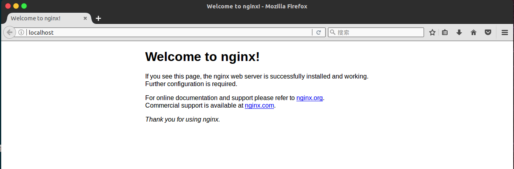
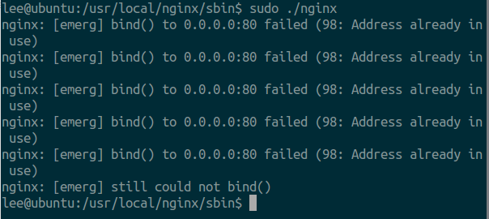
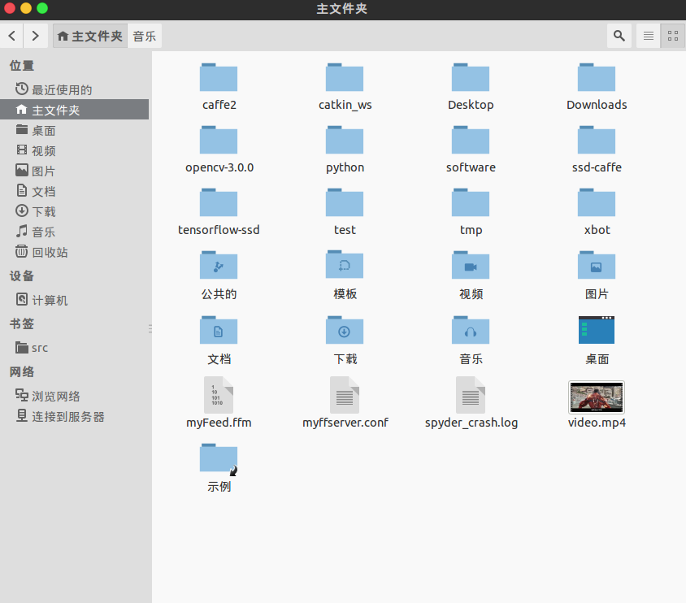
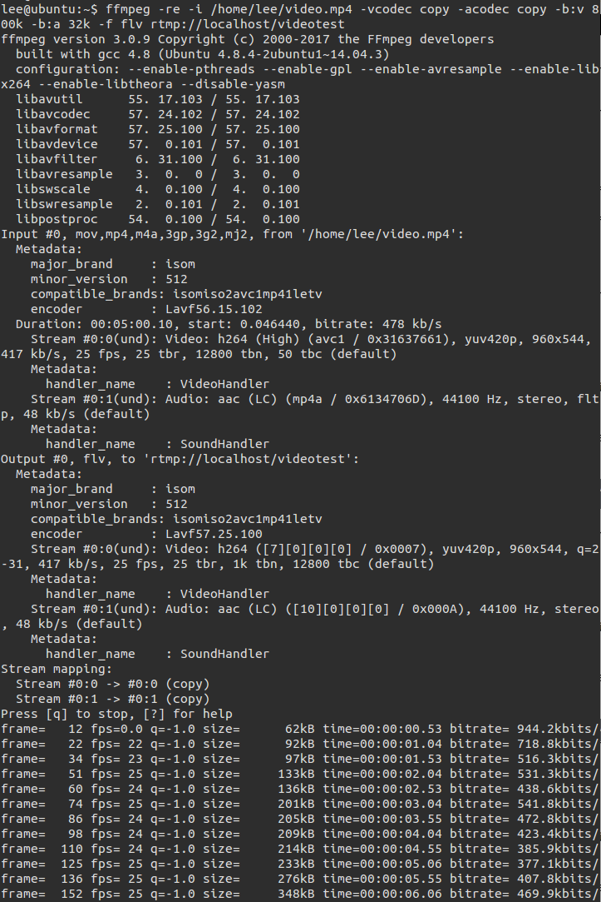
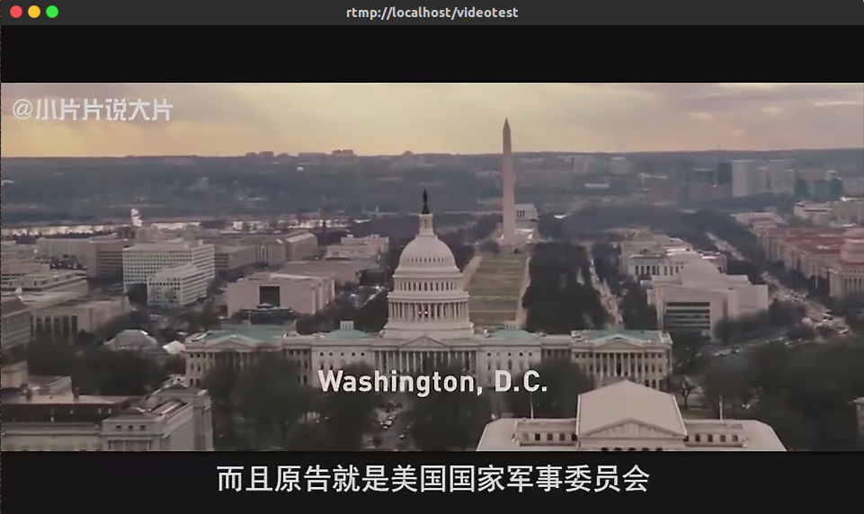

#  搭建Nginx-rtmp流媒体服务器并使用ffmpeg进行推流 

by -- [lisongting ](https://www.github.com/lisongting)

最近尝试着搭建了搭建一个[基于RTMP协议](https://en.wikipedia.org/wiki/Real-Time_Messaging_Protocol) 的流媒体服务器，我首先尝试使用了[SRS](https://github.com/ossrs/srs)  ，感觉它的文档写的不是很详细，对于入门新手没有一个通俗易懂的文档教程，所以就放弃使用SRS了。于是我采用了Nginx流媒体服务器，并使用 [ffmpeg](https://en.wikipedia.org/wiki/FFmpeg) 进行推流，成功推流本地视频到流媒体服务器上，可以正常播放。


接下来开始进入手把手教程。

## 1.安装ffmpeg 

首先安装h264 视频编解码库：

```
sudo apt-get update
sudo apt-get install libx264-dev
```


安装ffmpeg ，依次输入以下命令：

```
wget http://ffmpeg.org/releases/ffmpeg-3.0.9.tar.bz2
sudo tar jxvf ffmpeg-3.0.9.tar.bz2 
cd ffmpeg-3.0.9/
sudo ./configure --enable-shared --enable-pthreads --enable-gpl  --enable-avresample --enable-libx264 --enable-libtheora  --disable-yasm

sudo make	//这个过程比较久
sudo make install
```

安装完ffmpeg之后，在命令行中输入`ffmpeg` 就可以看到类似下面的输出信息：

```
lee@ubuntu:~$ ffmpeg
ffmpeg version 3.0.9 Copyright (c) 2000-2017 the FFmpeg developers
  built with gcc 4.8 (Ubuntu 4.8.4-2ubuntu1~14.04.3)
  configuration: --enable-pthreads --enable-gpl --enable-avresample --enable-libx264 --enable-libtheora --disable-yasm
  libavutil      55. 17.103 / 55. 17.103
  libavcodec     57. 24.102 / 57. 24.102
  libavformat    57. 25.100 / 57. 25.100
  libavdevice    57.  0.101 / 57.  0.101
  libavfilter     6. 31.100 /  6. 31.100
  libavresample   3.  0.  0 /  3.  0.  0
  libswscale      4.  0.100 /  4.  0.100
  libswresample   2.  0.101 /  2.  0.101
  libpostproc    54.  0.100 / 54.  0.100
Hyper fast Audio and Video encoder
usage: ffmpeg [options] [[infile options] -i infile]... {[outfile options] outfile}...

Use -h to get full help or, even better, run 'man ffmpeg'

```

如果出现这样的信息，说明ffmpeg已经安装成功了。

## 2.安装Nginx依赖

我是在根目录下安装的依赖。首先在根目录下创建一个叫做nginx-dependence的文件夹

```
cd ../../
sudo mkdir nginx-dependence
```

然后在nginx-dependence中安装依赖，按行依次运行以下命令。这些依赖一定不要使用`apt-get` 安装 ，因为后面在配置Nginx的时候，要提供这些依赖的源码路径。（我一开始是使用`apt-get` 安装 依赖的，结果在nginx 的`configure` 步骤出现问题，所以我就重新安装了）

```
cd nginx-dependence
sudo wget ftp://ftp.csx.cam.ac.uk/pub/software/programming/pcre/pcre-8.40.tar.gz 
sudo tar -zxvf pcre-8.40.tar.gz 
cd pcre-8.40/
sudo ./configure 
sudo make
sudo make install

sudo wget http://zlib.net/zlib-1.2.11.tar.gz
sudo tar -zxvf zlib-1.2.11.tar.gz 
cd zlib-1.2.11/
sudo ./configure 
sudo make 
sudo make install

sudo wget https://www.openssl.org/source/old/1.1.0/openssl-1.1.0.tar.gz
sudo tar -axvf openssl-1.1.0.tar.gz 
cd openssl-1.1.0/
sudo ./config 
sudo make 
sudo make install
```

在nginx-dependence目录中，先下载nginx-rtmp-module

```
git clone https://github.com/arut/nginx-rtmp-module.git
```


## 3.安装Nginx

首先运行:

```
apt-get install build-essential
apt-get install libtool
```

然后下载并安装Nginx，我安装的版本是1.12.0，我也是安装在根目录的。

依次运行下面的指令。

```
cd ../../

sudo wget http://nginx.org/download/nginx-1.12.0.tar.gz

sudo tar -zxvf nginx-1.12.0.tar.gz 

cd nginx-1.12.0/

sudo ./configure --prefix=/usr/local/nginx --with-pcre=../nginx-dependence/pcre-8.40 --with-zlib=../nginx-dependence/zlib-1.2.11 --with-openssl=../nginx-dependence/openssl-1.1.0  --with-http_ssl_module --add-module=/nginx-dependence/nginx-rtmp-module 

sudo make 

sudo make install
```

`--with-pcre=../nginx-dependence/pcre-8.40` 就是我的pcre依赖所放置的位置，这个位置可根据自己的安装位置进行灵活配置。`--add-module=/nginx-dependence/nginx-rtmp-module ` 这个module 的路径也要正确设置为之前下载nginx-rtmp-module的路径。


如果上面的步骤都没有出错，则可以检验一下nginx是否已经安装正确了：

在命令行中输入这个命令启动nginx服务器：

```
sudo /usr/local/nginx/sbin/nginx
```

如果没有报任何错误，则可以打开浏览器看看nginx是否启动成功。

打开浏览器，输入`localhost`  或本机的IP地址，按回车，如果看到这样的界面，说明nginx已经安装成功并且启动成功了。

 


如果有的时候启动时出现这样的提示：



这是重复启动导致的。运行`sudo /usr/local/nginx/sbin/nginx -s stop`  可以先停止运行之前启动的，然后再次运行

`sudo /usr/local/nginx/sbin/nginx` 就没有问题了。


## 4.配置Nginx流媒体服务器

nginx服务器有一个配置文件叫做**nginx.conf** ，这个文件默认是位于**/usr/local/nginx/conf **  目录下。

我将这个文件改成这样：

```
worker_processes  1;
error_log  logs/error.log debug;

events {
    worker_connections  1024;
}
rtmp {
    server {
        listen 1935;
            		
		application videotest{
			live on;
		}
    }
}

http {
    include       mime.types;
    default_type  application/octet-stream;
    sendfile        on;
    keepalive_timeout  65;
    server {
        listen       80;
        server_name  localhost;

        location / {
            root   html;
            index  index.html index.htm;
        }

        # redirect server error pages to the static page /50x.html
        error_page   500 502 503 504  /50x.html;
        location = /50x.html {
            root   html;
        }
    }
}
```

其中rtmp就是rtmp服务器模块，端口是1935，application我理解为一个路径。可以通过访问`rtmp://localhost/videotest` 来访问videotest这个资源。`live on ` 表示这是实时的传输，这不同于点播，点播就好比我在某视频网站上想看一个视频，无论我什么时候去点击，它会从头开始播放。而实时传输（直播），就是好比看电视，我在19:20去打开电视（打开直播路），视频不会从头开始播放，而是从当前(19:20)的视频数据开始播放。

除了配置rtmp服务器，还可以配置HTTP和HTTPS服务器。这方面我还没有深入去了解。更多关于nginx服务器和其配置方式，请阅读[nginx官网](http://nginx.org/en/docs/) 。


## 5.使用 ffmpeg 推流本地视频


把配置文件改成第4步中的形式，然后启动nginx。

```
sudo /usr/local/nginx/sbin/nginx
```

我在/home/lee目录下放置了一个视频 video.mp4，



然后在命令行中使用 ffmpeg 进行推流：

```
ffmpeg -re -i /home/lee/video.mp4 -vcodec copy -acodec copy -b:v 800k -b:a 32k -f flv rtmp://localhost/videotest
```

这里有好几个参数，

`-re ` : 表示使用文件的原始帧率进行读取，因为ffmpeg读取视频帧的速度很快，如果不使用这个参数，ffmpeg可以在很短时间就把video.mp4中的视频帧全部读取完并进行推流，这样就无法体现出视频播放的效果了。官方文档中对这个参数的解释是：

> -re (*input*)
>
> ​	Read input at native frame rate. Mainly used to simulate a grab device, or live input stream (e.g. when 	reading from a file). Should not be used with actual grab devices or live input streams (where it can cause packet loss). By default `ffmpeg` attempts to read the input(s) as fast as possible. This option will slow down the reading of the input(s) to the native frame rate of the input(s). It is useful for real-time output (e.g. live streaming).

`-i` :这个参数表示输入 ，后面`/home/lee/video.mp4` 就是输入文件。

`-vcodec copy  ` : -vcodec表示使用的视频编解码器 ，前缀v表示video。后面紧跟的`copy`  表示复制使用源文件的视频编解码器，比如原文件的编解码器(codec)是h264，则这里就使用h264。

`-acodec copy ` : -acodec表示使用的音频编解码器，前缀a表示audio。后面的`copy` 表示使用源文件的音频编解码器。

`-b:v 800k` : -b:v表示视频的比特率(bitrate) ，为800k。

`-b:a 32k` : 表示音频的比特率为32k。

`-f flv` : -f表示format ，就是强制输出格式为flv，这一步其实也叫封装(mux)，封装要做的事就是把视频和音频混合在一起，进行同步。紧跟在后面的`rtmp://localhost/videotest` 表示输出的"文件名"，这个文件名可以是一个本地的文件，也可以指定为rtmp流媒体地址。指定为rtmp流媒体地址后，则ffmpeg就可以进行推流。


如果推流成功的话，就会输出下面的信息：

 

其中输出了一些源文件的信息。最下面的是一些帧数据，下面这些帧数据会一直输出直到视频推送完毕。


打开新的命令行，输入：

```
 ffplay rtmp://localhost/videotest
```

表示使用`ffplay ` 来播放指定流媒体文件。ffplay 是ffmpeg 中自带的媒体播放程序。然后就可以看到下面的视频了




推流成功后，在任何支持rtmp流媒体协议的播放器都可以播放。我在安卓中使用了七牛云的开源播放器[PLDroidPlayer](https://link.jianshu.com/?t=https://github.com/pili-engineering/PLDroidPlayer) ，播放了刚刚推流到服务器上的视频，下面是运行的截图。


后记：ffmpeg真是博大精深啊，不仅提供了强大的命令行工具`ffmpeg` ,  `ffprobe`  , `ffplay`,   `ffserver` 方便我们对音视频进行处理（其实使用ffserver也可以搭建流媒体服务器）。ffmpeg还提供了底层丰富的[API](http://ffmpeg.org/doxygen/trunk/index.html) ，这一方面内容我还需要深入学习。