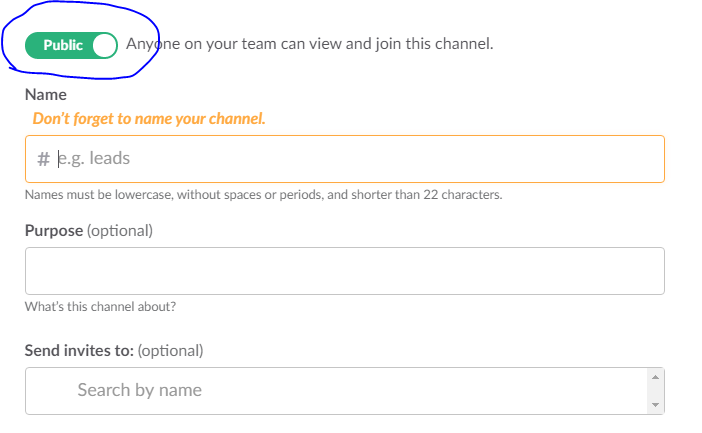
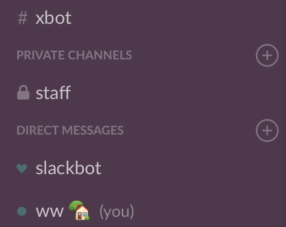

# tools/slack

我们使用slack作为团队的交流和协作平台。

新成员在加入后，在内训阶段需要获得一下技能：

## 基本slack操作能力

[Slack-Guides](https://get.slack.help/hc/en-us/categories/202622877-Slack-Guides)

[Get-around-faster](https://get.slack.help/hc/en-us/articles/217626598-Get-around-faster)

[Setting-reminders](https://get.slack.help/hc/en-us/articles/208423427-Setting-reminders)

[Slack-for-project-management](https://get.slack.help/hc/en-us/articles/218130338-Slack-for-project-management)

[Format-better-messages](https://get.slack.help/hc/en-us/articles/218080247-Format-better-messages)

[Slack-glossary](https://get.slack.help/hc/en-us/articles/213817348-Slack-glossary)

[Slack-Do Not Disturb and snooze Settings](https://get.slack.help/hc/en-us/articles/214908388-Do-Not-Disturb-and-snooze-settings)

- 正确注册和加入slack

- 在手机、iPad、Mac／Windows上正确安装和配置好slack

- 在 #general 频道给全体人员发一条 hello world

- 加入 #interns 等频道

- star 自己发送的第一条信息

- thread 自己发送的第一条信息，回复一个赞

- 上传一张图片／粘贴屏幕截图

- 打开Files窗口查看自己上传的文件列表

- 在聊天频道中 @ 一个人

### 一些日常操作习惯

- slack在线的时候可以发送一句 `/away` 标记自己在线，下线了再敲一句 `/away` 改成下线， 这样同事我就可以避免在你下线的时候找你了。
- slack在线时可以使用'/dnd for 15 minutes'
- 或者'/dnd until tomorrow morning'、'/dnd until 2:15'、'/dnd until tonight'等来设定免打扰时段
- 如果想要取消免打扰, 则只需再次发送 /dnd 即可取消

## todolist

基本的todolist操作能力 https://www.todobot.io/slack/

- 在聊天窗口中使用 /todo 'add your first task'

- 在聊天窗口中使用 /todo @other

- 在聊天窗口中使用 /mytodo list

- 在聊天窗口中使用 /todo help

## reminder
使用`/remind`功能提醒自己或他人不要忘记某些事项。

[slack help center](https://get.slack.help/hc/en-us/articles/208423427-Setting-reminders)

使用语法:

　　`/remind [@someone or #channel] [what] [when]`

例如(任意聊天窗口输入）：

　　`/remind me every weekday at 2pm to take a coffee break`

到时 slackbot 会自动发送消息提醒。

## reaction
[Emoji-reactions](https://get.slack.help/hc/en-us/articles/206870317-Emoji-reactions)

聊天框里每句话的右上角，鼠标指向此位置出现add reaction和start a thread等框，点击可对该句给予回应；

输入栏按快捷键ctrl+shift+\，可打开表情库；

## channels
[channels](https://get.slack.help/hc/en-us/articles/201925108-About-channels-and-direct-messages)

**如何创建channel**：在Slack左侧列表上方有'+'号，可以创建channel；

**channel分类**：public channel和private channel. 在创建时会允许用户设置channel类型，默认为public,用户也

可以修改为privae；然后添加channel名字和channel的用途描述；

**不同类型channel的作用**：public channel内的消息对于整个team的人可见，且组员可自己申请加入；而private channel中

的消息仅对此channel内成员可见，且channel不可被搜索. team其它成员想要加入，必须以被邀请的形式加入。

**如何识别channel类型**： private channel左端有一个小锁图案; public channel是没有的;

## direct messages
[Direct-messages-and-group-DMs](https://get.slack.help/hc/en-us/articles/212281468-Direct-messages-and-group-DMs)

开启对话，与一人的单独对话或9人以下的组对话；

点击左侧竖栏的Direct Messages后的“+”，打开direct messages界面，选择一个或多个成员，开启对话；

任意输入栏输入/dm(或/msg) @ww，可打开与用户@ww的对话框发送单独消息；

输入栏按快捷键ctrl+shift+K（window）或cmd+shift+K，打开direct messages界面；

## 从一句发言开始创建新的thread

thread 在slack中并不是作为线程来用，而是用来针对某人发出的话语进行讨论，可以多人参与。（类似于朋友圈中的回复功能）

使用方法：

1.对于别人的发言，点击发言框右上角这个按钮：（我这里使用todobot进行演示）

2.然后就可以添加回复，比如我输入“test thread”：

点击send。回复成功

3.点击slack左侧的All Thread，在这里就可以看到跟你相关的所有消息回复。

使用threads的好处：

- 可以对某个话题进行小讨论，这样可以避免影响其他人的正常工作。（因为如果直接回复一条新消息的话，会使得channel里的所有人都收到消息通知）
- 让大家参与到讨论的同时，又不至于使得聊天记录变得很混乱，这样方便了后期对聊天记录的查找。

## github

- TBD

## TLCL

