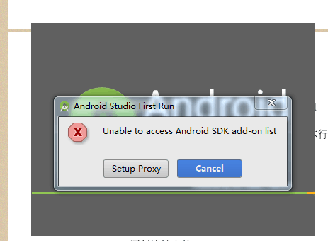
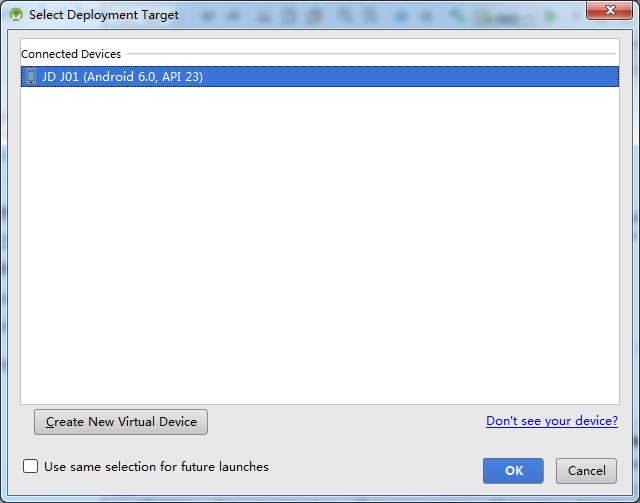

# xbot_head运行流程

xbot_head安装到安卓移动端，ROS服务器运行于Ubuntu电脑，与优图服务器接入同一局域网，则可成功运行；

-1.安装Android Studio

[Android Studio](http://www.android-studio.org/)

选择合适机型安装包下载并安装；

遇如上弹窗直接点击cancel；

-2.在git上下载xbot_head工程并安装到安卓设备

[xbot_head](https://github.com/lazyparser/xbot_head)

根据下载地址，在Android studio中import此工程；

将安卓设备插入电脑；

运行工程，点击run‘app’，选择该设备，从而完成在设备上的安装；

之后设备上安装完成一个名为“优图人脸识别前端”的应用。

-3.安装ubuntu系统

给装此系统的电脑插上安装U盘，重启电脑；

开机时按F2键（取决于机型，一般是 F12 F9 F2 F7,可顺次按F1~F10键尝试），弹出bios界面，选择用U盘启动；

按照提示安装系统。

-4.安装ROS

[ROS_Kinetic](http://wiki.ros.org/kinetic/Installation/Ubuntu)

如果是ubuntu16.04，用kinetic；如果是14.04，用indigo；

在Ubuntu系统中打开命令行：ctrl+alt+t;

* 配置 Ubuntu 软件仓库

* 添加 sources.list，配置你的电脑使其能够安装来自 packages.ros.org的软件包

  sudo sh -c 'echo "deb http://packages.ros.org/ros/ubuntu $(lsb_release -sc) main" > /etc/apt/sources.list.d/ros-latest.list'

* 添加Keys

  sudo apt-key adv --keyserver hkp://pool.sks-keyservers.net --recv-key 421C365BD9FF1F717815A3895523BAEEB01FA116

* 确保安装包是最新的

  sudo apt-get update

*完整版安装

  sudo apt-get install ros-kinetic-desktop-full

* 初始化rep

  sudo rosdep init
  
  rosdep update

* 环境配置，确保把 . /opt/ros/indigo/setup.sh 这行配置放在 ~/.bashrc 里；

  echo "source /opt/ros/kinetic/setup.bash" >> ~/.bashrc
  
  source ~/.bashrc

* 安装rosinstall

  sudo apt-get install python-rosinstall

-5.启动ROSbrige服务

在命令行运行如下命令：

  roslaunch rosbridge_server rosbridge_websocket.launch

另开一个命令行，运行：

  netstat -tnlpu4
  
确认9090 端口和 11311 端口都开始监听。

-6.Troubleshooting

* 安装ros后，在执行roslaunch rosbridge_server rosbridge_websocket.launch命令时，如果报错：The program 'roslaunch' is currently not installed. 说明/opt/ros/kinetic/setup.bash没有被执行。此时source ~/.bashrc，或者重启计算机。

* 安装ros后，在执行roslaunch rosbridge_server rosbridge_websocket.launch命令时，如果报错：[rosbridge_websocket.launch] is neither a launch file in package [rosbridge_server] nor is [rosbridge_server] a launch file name.此时说明rosbridge没有安装。解决方式：

  sudo apt-get install ros-[rosdistr]-rosbridge-server

  [rosdistr]指你的ros版本，执行时把它替换为对应的字符串。我的是kinetic
